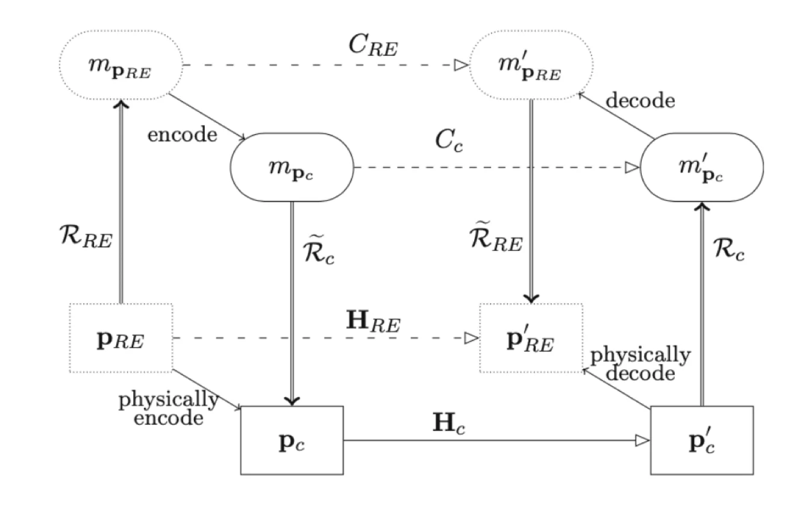

## Context

Conventional computing (our every day PC, Phone, Server etc), is based on highly developed theories of classical computing, heavy software engineering around Operating Systems and the extraordinary engineering of CMOS technology. [Unconventional Computing](../uncomp/index.qmd) is going beyond that path, extending the barriers between philosophy and engineering by exploring different physical systems and information processing paradigms.

Ultimately, both computing models should question the confidence of using a system as a computer. To address this question, we need to have a formalized computing model to decide whether the system is a computer. When we move beyond Classical Computing, the foundations of Information Science continue to be revisited. Is the human mind a computer? These foundations are the choreography between Information, Computation, and Computer [@jaeger2023].

## Information

Information is always tied to a physical representation. Maxwell's Demon [@maxwell_demon] illustrates the profound connection between information and thermodynamics. While the demon's ability to decrease entropy appears to violate the second law of thermodynamics, the resolution lies in realizing that information processing has thermodynamic costs. In the 1960s, Rolf Landauer formalized that erasing information in a computing system must produce a corresponding increase in entropy, typically manifesting as heat dissipation [@landauer1961]. 

This principle helped to resolve the paradox by showing that the demon's measurements and memory erasures result in an overall increase in entropy, thus preserving the second law of thermodynamics. These advances and experiments led to accepting information as a physical entity. Extending the formalization further, "the laws of physics are essentially algorithms for calculations," as cited by Landauer [@landauer1996].

## Computation

Since we can describe our understanding of physical objects with a theory and mathematical abstract objects, we can calculate and predict their evolution by performing computations.

We use computers in our everyday lives, and we let them perform these computing operations for us because we first understand them, model them, and then fabricate them. Abstraction/Representation (AR) theory (Horsman et al. 2014) has been developed to formalize the definition and requirements of a physical system that can be used as a computer [@horsman2014].

## Computer

A computer is a physical system with constituent parts and internal interactions that transition from one physical state to another. It must be capable of encoding and decoding information and performing at least one fundamental dynamical operation. Central to this definition is the representation relation, which maps physical systems to mathematical objects, allowing comparisons and defining when a physical process is utilized for computation. The theory distinguishes the abstract and physical spaces and connects them solely by the relation of the directed representation.

Furthermore, AR Theory introduces the notion of computational entities (physical entities that locate the representation relation), which is essential for establishing when computing occurs within physical systems. These entities are responsible for the encoding and decoding steps, crucial for translating abstract data into physical states and vice versa (Humans or any Intelligent system). A computer is used to predict the outcome of an abstract evolution. This predictive capability distinguishes computing from other physical process evolution, as the system must reliably perform computations that produce predictable results.

## The Full Compute Cycle

Stepney and Kendon extended the AR model to include a Representational Entity (RE), which supports the representation relation between physical and abstract entities [@stepney2021].

The full compute cycle (@fig-compute-cycle) involves representing the representational entity's desired physical state $P_{RE}$ as an abstract model $m_{P_{RE}}$, encoding this to a computational model $m_{P_c}$, and instantiating it into the physical computer state $P_c$. The physical computer then evolves to the state $P'_c$, with the physical evolution $H_c$. The new state is represented as an abstract computational solution $m'_{P_c}$. Finally, this is decoded to the abstract problem solution $m'_{P_{RE}}$, which is the result of abstract evolution $C_c$, modeling the final state of the RE. Each step should approximately commute, ensuring consistency between the representational entity and the physical computer throughout the compute cycle.

{#fig-compute-cycle}

Therefore:

[Computing is understanding.]{.mark}[@adamatzky2017]

## References

::: {#refs}
:::
