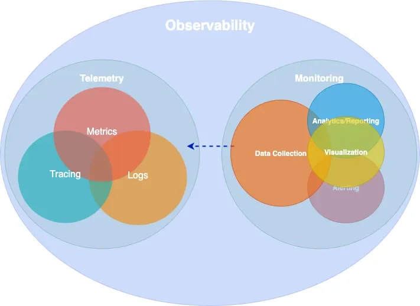

It's 3:00 AM. A phone rings, PagerDuty calls and starts speaking with a robot voice, spelling the alert name: *"SLO burn rate page — payment service error budget exhausted"*.

The on-call engineer opens the workstation, VPN connection, Grafana, half-asleep. The error rate panel is red. Requests are failing. 

So, the intuitive question is: *what* is failing? The payment service, we know that. But *which* part of the payment service? The database? The cache? The third-party payment provider? The load balancer? The network?

*Why*? (All looked good earlier though, what happened!)

This is where the distinction between monitoring and observability stops being academic.
We need to find a cause we never predicted — and we need to find it now, because every minute is lost revenue. Also, we need to write that Postmortem with clear timeline, RCA, and action items. We can't just say "the payment service is broken" — we need to know *why* and *what* to fix.


Yeah, this can be difficult, and it requires a shift in mindset. We need to think about observability not just as a set of tools, but as a fundamental property of our systems.

## Observability in Control Theory

The term *observability* did not originate in software engineering. It comes from control theory, introduced by Rudolf Kálmán in 1960 as a formal property of linear dynamical systems [@majors2022observability]. A system is *observable* if and only if its complete internal state can be reconstructed from its external outputs over a finite time interval [@kalman1960contributions]. Mathematically, for a linear time-invariant system described by state matrix $A$ and output matrix $C$, the system is observable when the **observability matrix**

$$
\mathcal{O} = \begin{bmatrix} C \\ CA \\ CA^2 \\ \vdots \\ CA^{n-1} \end{bmatrix}
$$

has full rank, its rows are linearly independent and span the entire [state-space](https://en.wikipedia.org/wiki/State-space_representation).


::: {.callout-tip}
## Refreshing the foundations
Several concepts in SRE and observability — observability itself, cardinality, signal independence, sampling — trace their roots to linear algebra, control theory, and information theory. If these connections feel rusty, *Essential Mathematics for Quantum Computing* [@woody2022quantum] is a surprisingly good refresher.
:::

In state-space, there is the notion of [Controllability](https://en.wikipedia.org/wiki/Controllability), along with Observability. A system is *controllable* if we can drive it from any initial state to any desired final state within finite time, using appropriate inputs. The duality between controllability and observability is a fundamental principle in control theory: a system is controllable if and only if its dual system is observable. 

This duality maps loosely to our domain: observability lets us *understand* the system's state, and the actions we take based on that understanding — scaling, rollbacks, feature flags, config changes — are the control inputs that make it *controllable*.

This mathematical framing carries a useful intuition into our domain. A distributed system is "observable" (and moreover *controllable*) to the degree that we can determine what is happening *inside* it purely from what it emits *outside* — its telemetry. The more independent dimensions of information we capture (and the higher the cardinality within each dimension), the more of the system's internal state we can reconstruct. We will return to the connection between cardinality and linear independence shortly.

In practice, software systems are far more complex than linear dynamical systems — they are non-linear, non-deterministic, and constantly changing. We cannot achieve perfect observability in the Kálmán sense, but the principle remains: 

::: {.callout-tip}
Design systems that emit enough information to reason about their internal state.
:::


## The distinction that matters

**Monitoring** is the practice of collecting, displaying, and alerting on *known* signals — dashboards for failures we anticipated, alerts for conditions we already understand [@beyer2016sre].

**Observability** is a property of the system itself: the degree to which we can reason about its internal state from external outputs, without deploying new instrumentation or running new queries [@majors2022observability].

The practical difference is sharp. Monitoring told us the payment service is failing. Observability is what lets us discover — at 3:00 AM, without shipping an instrumentation patch — that requests from mobile clients in Europe fail only when the user signed up after our last migration, because a database connection pool in `eu-west-1` saturates under a specific join pattern that the migration introduced.

No dashboard was built for that. No alert anticipated it. But if our system is observable, the data to find it is already there.

Observability is a superset of monitoring. We need both.

::: {#fig-observability}
{width=60%}
:::

## Epistemic categories of observability

Understanding what observability is *for* requires a framework for reasoning about knowledge gaps. The **Johari Window** [@luft1955johari], originally developed in psychology by Joseph Luft and Harrington Ingham in 1955, provides exactly this. It classifies knowledge along two axes — *what we know* and *what we are aware of* — producing four epistemic categories:

|  | **Aware** | **Not aware** |
|---|---|---|
| **Know** | Known-knowns | Unknown-knowns |
| **Don't know** | Known-unknowns | Unknown-unknowns |

In our domain, these map directly to different observability challenges [@gregg2020systems]:

**Known-knowns** are things we track and understand. Error rate is 2%. CPU is at 60%. Standard monitoring handles these well — they are the dashboards we already built.

**Known-unknowns** are things we know we can't see yet. "CPU is high but we don't know which service." We handle these by extending our monitoring — adding a dashboard, writing an alert.

**Unknown-knowns** are things we have the data for but don't realize. The telemetry that would explain the outage is already being collected, but it's buried in an unqueried label or a log field nobody thought to filter on. This is more common than most teams admit — the answer was *right there*, but nobody knew to look.

**Unknown-unknowns** are things we don't know we don't know. That payment failure from our 3:00 AM incident — a specific client type, region, signup cohort, and time window intersecting to produce errors — is an unknown-unknown. No pre-defined alert catches it. No dashboard was built for it.

Monitoring handles the first two categories. Observability targets the last two — and especially the unknown-unknowns. It requires instrumentation rich enough to let us ask *arbitrary* questions after the fact, not just the ones we thought of in advance. This capability is sometimes called *Explorability* [@pi2024observability]: the ability to interactively navigate telemetry data without knowing in advance what we are looking for.

The technical requirement for explorability is **high-cardinality, high-dimensionality** data: many unique values per field (user IDs, request IDs, build versions) across many fields simultaneously. This is what makes exploratory debugging possible — and it's also what makes observability expensive, a tension we will return to.

### A note on cardinality

The concept of cardinality deserves a brief digression, because it connects the mathematical origins of observability to the practical challenges of running an observable system.

In linear algebra, we say a set of vectors is [linearly independent](https://en.wikipedia.org/wiki/Linear_independence) if no vector in the set can be expressed as a linear combination of the others. The maximum number of linearly independent vectors in a space defines its **dimension** — the number of independent directions we need to describe any point. If our measurement vectors are not independent (say, we track both `total_requests` and `successful_requests + failed_requests`), we gain no new information from the redundant signal.

In observability, **cardinality** refers to the number of unique values a given label (which translates to a dimension) can take. A label like `status_code` has low cardinality (a few hundred values at most). A label like `user_id` has high cardinality (potentially millions). When we combine multiple and extremely high-cardinality labels — user ID × request ID × region × build version — the number of unique time series explodes combinatorially.

This is the fundamental trade-off of observability. High-cardinality and high-dimensionality data is what makes unknown-unknown debugging possible — each independent dimension is like an independent vector in our observability matrix, expanding the space of internal states we can reconstruct. But it is also what makes observability *expensive*, because every unique combination of labels creates a new time series that must be stored and indexed. The art of observability engineering is finding the *right balance*: enough independent dimensions to diagnose novel failures, without generating so many time series that the system becomes noise, costly and unqueryable.


## White-box, black-box, and synthetic monitoring

Before diving into telemetry signals, it is worth establishing a foundational distinction in *how* we observe systems.

**White-box monitoring** examines the internal state of a system using data it emits itself — metrics exposed by application code, structured log entries, distributed traces. It is based on *instrumentation*: code we write (or inject) to make the system's behavior visible. White-box monitoring excels at diagnosing *why* something is broken, because it has access to internal context like queue depths, error types, and code-level latency breakdowns [@beyer2016sre].

**Black-box monitoring** tests externally visible behavior without any knowledge of internals — probing the system the way a user would. An HTTP health check, a TCP port probe, or a DNS lookup test are all black-box. Black-box monitoring excels at detecting *that* something is broken, especially failures that internal metrics might miss (a load balancer routing to a dead backend, a DNS resolution failure, a TLS certificate expiry). As the Google SRE Book notes, black-box monitoring is symptom-oriented and represents active problems rather than predicted ones [@beyer2016sre].

**Synthetic monitoring** is a specialized form of black-box monitoring where we generate *artificial* traffic that mimics real user behavior. Synthetic checks run continuously from multiple geographic locations, executing scripted user journeys — logging in, searching, completing a checkout — against production or staging environments. They serve two purposes: first, they detect problems before real users encounter them (especially valuable for low-traffic services where real user signal is sparse); second, they provide a baseline measurement of performance from the user's perspective, independent of internal metrics.

In practice, a mature observability strategy combines all three. Synthetic monitoring and black-box probes tell us whether the system is working *for users*. White-box instrumentation tells us *why* when it isn't.


## Telemetry Data

Every observable system emits signals — structured data that, taken together, make its internal behavior visible from the outside. There are several ways to classify these signals. The industry has broadly converged on four primary types, often called **MELT** (Metrics, Events, Logs, Traces). The more conventional framing groups three of these — metrics, logs, and traces — as the "three pillars of observability." The origins of both terms are difficult to trace, but they are widely referenced across the observability space.

The pillars framing has been useful, though it carries a subtle limitation: treating the signals as independent pillars can lead teams toward isolated data stores that are difficult to correlate. 

How many times have we checked logs in one system, metrics in another, and traces in a third — context-switching between tools to reconstruct a single incident (and probably forgetting to save that screenshot or export that log)?

Charity Majors explores this tension in what she calls "Observability 2.0" [@majors2024obs2] — a model built on arbitrarily-wide structured events from which metrics, logs, and traces can be *derived*, rather than stored separately. Grafana Labs has proposed moving "from pillars to rings," with deep cross-signal correlation built in rather than bolted on [@grafana2025pillars]. OpenTelemetry co-founder Ted Young reframed the signals as "three strands of a braid." We do not need to pick a specific path, but the direction is clear: the value is not in the individual signals but in how they connect.

In the sections that follow, we examine the most important signals individually.

### Metrics

A metric is a numeric measurement of a system's behavior over time. This definition is deceptively simple — understanding what constitutes a *useful* metric requires understanding how metrics relate to the physical resources they measure.

**Statistics form a metric.** A raw metric is rarely a single number. It is a *summary statistic* computed over a population of observations. When we say "p99 latency is 200ms," we are describing the 99th percentile of a distribution of individual request latencies — a statistical aggregation that discards the individual data points. The choice of statistic (mean, median, percentile, max, standard deviation) determines what the metric reveals and what it hides. Averages hide outliers. Percentiles reveal tail behavior. Histograms preserve the full distribution at the cost of higher storage.

The Prometheus data model — now effectively an industry standard — defines three fundamental metric types.

A **counter** is a monotonically increasing value that only goes up. Total HTTP requests, total bytes sent, total errors. Counters are almost always consumed as *rates* — `rate(http_requests_total[5m])` gives us requests per second. The raw counter value is rarely meaningful on its own.

A **gauge** is a value that can go up or down. Current CPU utilization, memory usage, queue depth, active connections. Gauges represent a snapshot of current state, unlike counters which represent cumulative totals.

A **histogram** records observations (like request latency) in configurable buckets, preserving distributional information. A histogram exposes multiple time series: cumulative counters for each bucket (`_bucket`), a total sum of observed values (`_sum`), and a count of observations (`_count`). This allows computing arbitrary percentiles at query time using functions like `histogram_quantile()`.

```
# HELP http_request_duration_seconds Request latency histogram
# TYPE http_request_duration_seconds histogram
http_request_duration_seconds_bucket{le="0.05"} 24054
http_request_duration_seconds_bucket{le="0.1"}  33444
http_request_duration_seconds_bucket{le="0.5"}  100392
http_request_duration_seconds_bucket{le="1.0"}  129389
http_request_duration_seconds_bucket{le="+Inf"} 133988
http_request_duration_seconds_sum 53845.99
http_request_duration_seconds_count 133988
```

**Metrics in operating systems.** The concept of system metrics long predates distributed systems. The Unix `sar` (System Activity Report) tool, part of the `sysstat` package, has been collecting CPU, memory, disk, and network metrics using `/proc` filesystem. Modern Prometheus node exporters collect fundamentally the same data that `sar` has tracked for decades — we have simply added labels, dimensional indexing, and remote storage to a practice that is older than most of the engineers using it.

**Time-based and capacity-based metrics.** Brendan Gregg's *Systems Performance* [@gregg2020systems] draws an important distinction between two categories of resource metrics. *Time-based metrics* express utilization as the proportion of time a resource is busy — a CPU that is busy 60% of the time has 60% utilization. *Capacity-based metrics* express utilization as the proportion of capacity consumed — a disk that is 70% full. The distinction matters because they saturate differently: a CPU at 100% time-based utilization is a bottleneck (all requests queue), while a disk at 100% capacity-based utilization is a hard failure (no more writes). 


::: {.callout-tip}
Time-based utilization is often linked with resource *saturation*, and capacity-based with *pressure*.
:::

Aggregation enables efficient storage and fast queries at the cost of detail. Managing that trade-off means being deliberate about what we keep: filtering unnecessary metrics, labels, pre-computing expensive queries with recording rules, and treating cardinality as a resource to be budgeted.

### Events

An event is a discrete record of something that happened at a specific point in time — a deployment, a configuration change, an auto-scaling action, an alert firing. Events differ from metrics (which are continuous numeric signals) and from logs (which record granular operational detail). Events capture *state transitions* and *notable occurrences* that provide context for interpreting other signals. When we see a latency spike on a dashboard, an overlaid deployment event marker often provides the explanation immediately.

Events are lightweight to produce and store, but their value depends entirely on discipline — if deployment events or config change annotations are not consistently emitted across all services, the correlation that makes them useful never materializes.

### Logs

A log is a timestamped, immutable record of a discrete occurrence within the system. Logs provide the richest context for debugging a specific moment — they can include error messages, stack traces, request parameters, and arbitrary key-value context.

```json
{
  "severity": "ERROR",
  "message": "upstream timeout",
  "trace_id": "abc123def456",
  "span_id": "789ghi",
  "service": "payment-gateway",
  "httpRequest": { "requestMethod": "GET", "latency": "2.3s" },
  "user_id": "u_98234",
  "region": "eu-west-1"
}
```

The critical requirement for logs to contribute to observability is **structure**. Unstructured text logs (`printf`-style) are nearly useless at scale — they cannot be efficiently queried, filtered, or correlated. Machine-parseable structured logs (JSON) with consistent fields, trace/span IDs, and adherence to semantic conventions (such as those defined by OpenTelemetry) are the minimum for an observable system.

Logs provide the richest context of any signal, at the highest storage cost. Not every operation deserves a log line — an INFO entry for every successful request is noise that we pay to store, index, and ignore.


### Traces

A trace is a record of a request's journey through a distributed system, composed of individual *spans* that represent operations within or across services. Each span records a start time, duration, status, and arbitrary attributes. Spans are linked together via parent-child relationships, forming a tree (or more precisely, a directed acyclic graph) that represents the full execution path.

**Tracing in operating systems.** Like metrics, the concept of tracing predates distributed systems. The Unix `strace` utility traces system calls made by a process — every `read()`, `write()`, `open()`, and `connect()` is recorded with arguments, return values, and timing. `strace` gives us a complete picture of how a process interacts with the kernel, making it an invaluable debugging tool for single-process problems. Tools like `dtrace` and `perf` extend this capability to kernel-level and hardware-level tracing. Distributed tracing extends the same idea across process and network boundaries: instead of tracing syscalls within one process, we trace *requests* across many services.

What makes distributed tracing work is **context propagation**. The W3C Trace Context specification [@w3ctrace] defines a standard `traceparent` header format (`version-trace_id-span_id-trace_flags`) that carries tracing identity across service boundaries in HTTP headers. Without propagation, there are no *distributed* traces — just isolated spans. This context also flows into logs (enabling trace-log correlation) and metrics (enabling exemplars, which we discuss in a later section).

Traces are essential for understanding request flow across service boundaries, but collecting every single one is rarely necessary or affordable. Sampling deliberately at a defined rate, and adjusting it when needed balances visibility with cost.

### Profiling

Profiling is code-level runtime analysis: which functions consume CPU time, how memory is allocated and freed, where threads contend on locks, and how garbage collection affects latency. Where traces show *which service* is slow, profiling shows *which code path* in that service is responsible.

Like metrics and tracing, profiling has deep roots in operating systems. The Unix `prof` and `gprof` tools have provided function-level CPU profiling since the 1980s. The Linux `perf` subsystem extends this with hardware performance counter access — sampling the instruction pointer at regular intervals to build a statistical picture of where CPU time is spent. Brendan Gregg's **flamegraph** visualization [@gregg2020systems], which transforms stack trace samples into a hierarchical, interactive chart of function call time, has become the de facto standard for reading profiling data.

Continuous profiling — running profilers in production with low overhead (typically 1–5%) — is increasingly treated as a fourth observability signal. Rather than profiling only during development or in response to a known problem, continuous profiling captures runtime behavior *all the time*, making it possible to compare a slow period against a healthy baseline after the fact. It bridges the gap between "this span took 800ms" (trace) and "the `parseJSON` function in the serialization layer consumed 650ms of that due to excessive allocation" (profile). In the Grafana stack, Pyroscope provides this capability, and trace-to-profile linking allows jumping directly from a slow span to the flamegraph of that code path.


## Instrumentation

Instrumentation is the practice of adding code (or injecting mechanisms) into a system so that it emits the signals shown in [@fig-observability]. In other words, it is the process of making a system's behavior visible by capturing context at meaningful points in its execution.

Instrumentation comes in several forms:

**Manual instrumentation** means writing explicit code to create spans, record metrics, and emit structured logs at meaningful points in our application. This gives us the most control, richest domain-level context and operational insights.

**Automatic instrumentation** uses libraries or agents to capture telemetry without modifying application code. Most language runtimes have auto-instrumentation packages that intercept HTTP clients, database drivers, and messaging libraries to generate spans and metrics automatically. The benefit is instant coverage with zero code changes, while the limitation is that automatic instrumentation captures only *framework-level* context (HTTP method, URL, status code) and misses *domain-level* context (user tier, order value, feature flag state).

**eBPF-based instrumentation** is a newer approach that operates at the kernel level. Tools like Grafana Beyla [@grafanabeyla] attach eBPF programs to Linux kernel functions to capture HTTP and gRPC traffic without any code changes or even language-specific agents. This shifts instrumentation from an application team responsibility to a platform team capability. The trade-off is that eBPF captures request-level metrics and traces (the RED signals discussed later) but cannot access application-level context or structured logs.

In practice, we need eBPF or automatic instrumentation for baseline coverage across all services, and manual instrumentation in critical code paths where domain-specific context matters most.

### OpenTelemetry as the industry standard

**OpenTelemetry** (OTel) has emerged as the dominant standard framework for instrumentation. It is the second-most-active CNCF project after Kubernetes, reached 1.0 stable specification across traces, metrics, and logs by mid-2025 [@otel2025stability], and the vast majority of organizations building new observability infrastructure now invest in it [@grafana2025predictions].

OTel provides a vendor-neutral **API** (defining *what* to instrument) and **SDK** (implementing *how* — sampling, batching, exporting). This separation means libraries can instrument against the API without coupling to a specific backend. The **OTel Collector** serves as a universal telemetry pipeline — receiving data in any format, processing it (batching, filtering, sampling, attribute enrichment), and exporting to one or more backends through a simple architecture of *receivers*, *processors*, and *exporters*.

The practical consequence is **instrument once, export anywhere**. Teams adopt OTel as their instrumentation layer and gain the freedom to switch, combine, or migrate backends as a configuration change rather than a re-instrumentation project.


## Exemplars: connecting metrics to traces

Once our system emits multiple telemetry signals, the next challenge is *connecting* them. An aggregated metric tells us something is wrong; a trace tells us exactly what happened. But how do we jump from one to the other?

An [exemplar](https://github.com/prometheus/OpenMetrics/blob/main/specification/OpenMetrics.md#exemplars) is a specific trace ID embedded in a metric data point, creating a direct bridge from an aggregated metric to the raw trace that produced it:

```
http_request_duration_seconds_bucket{le="0.5"} 100392 # {trace_id="KOO5S4vxi0o"} 0.42
http_request_duration_seconds_bucket{le="1.0"} 129389 # {trace_id="oHg5SJYRHA0"} 0.87
```

In Grafana, exemplars render as small dots overlaid on metric panels. Clicking a dot navigates directly to the corresponding trace in Tempo — turning a latency spike in a histogram into a one-click jump to the exact request that caused it.

This pattern extends beyond metrics-to-traces. In a well-correlated stack, **derived fields** in log aggregation tools extract trace IDs from structured log lines and link to traces. **Trace-to-logs** links a span to the correlated log lines emitted during its execution. **Trace-to-profiles** links a slow span to the flamegraph of that code path. The result is a connected web of signals where any entry point — a metric anomaly, a log error, a slow trace — leads to every other signal that shares the same context.

The investigation flow from our 3:00 AM incident illustrates this:

- the SLO burn-rate alert fires 
- we open the error rate panel 
- we click an exemplar on the spike
- the trace viewer shows the full request path
- one span reveals the upstream timeout
- we follow the trace-to-logs link and see the connection pool exhaustion
- the trace-to-profile link shows the hot code path. 

Grafana's [exemplars documentation](https://grafana.com/docs/grafana/latest/fundamentals/exemplars/) covers the configuration details for setting up this correlation workflow.

## Monitoring methodologies

Brendan Gregg's *Systems Performance* [@gregg2020systems] provides multiple methodologies — and anti-methodologies — for reasoning about system behavior. Before examining the useful frameworks, it is worth understanding a common failure mode.

### The blame-someone-else anti-method

Gregg describes several anti-methods — approaches that feel productive but fail to find root causes. The most instructive is the *blame-someone-else* anti-method: rather than investigating with data, a team hypothesizes the problem lies elsewhere and redirects the ticket. The receiving team does the same. The problem orbits between teams without anyone measuring anything. This thrives wherever observability is poor — when no team has data to prove where the bottleneck is, the default is deflection.

### Two directions of analysis: resources and workloads

Gregg frames performance analysis as approachable from two complementary directions [@gregg2020systems].

**Resource analysis** works *bottom-up*. We start with the physical and logical resources the system depends on — CPUs, memory, disks, network interfaces, file descriptors, mutexes, connection pools — and for each one, we ask: is it a bottleneck? This is systematic and exhaustive. By iterating through every resource and checking for signs of constraint, we methodically eliminate candidates. The weakness of resource analysis is that it tells us *which resource* is stressed but not *which workload* is causing the stress.

**Workload analysis** works *top-down*. We start from the application or service and examine the workload it is serving: who is making requests, what are they requesting, and how is performance? This perspective is request-centric — we follow the user's experience through the system. The weakness of workload analysis is the inverse: it tells us *which requests* are suffering but not *which resource* is responsible.

Neither direction alone is sufficient. The power comes from using both: workload analysis identifies *what* is slow, and resource analysis identifies *why*.

### USE: resource-oriented analysis

The **USE method** [@brendangregg2017use] is a formalization of resource analysis into a repeatable checklist. For **every resource** in the system, check three things: **Utilization** (how busy is it?), **Saturation** (how much queued or deferred work is there?), and **Errors** (are error events occurring?).

The key insight is the *exhaustive iteration*. USE does not ask "which resource do I think is the problem?" — it asks "for each resource, is there a problem?" This systematic sweep prevents the common trap of staring at a CPU dashboard while the actual bottleneck is file descriptor exhaustion or network saturation on an interface we never thought to check.

Recall the distinction between time-based and capacity-based utilization from our earlier discussion of metrics. USE applies to both, but the interpretation differs significantly. A CPU at 100% time-based utilization queues incoming work — saturation is high, but the situation is recoverable once load decreases. A disk at 100% capacity-based utilization rejects writes — that is a hard boundary, not a graceful degradation. Understanding which type of utilization we are measuring determines both the urgency and the response.

### RED: workload-oriented analysis

The **RED method** [@wilkie2018red] is the natural complement to USE, formalizing workload analysis for request-driven services. For **every service**, check three things: **Rate** (requests per second), **Errors** (failed requests per second), and **Duration** (distribution of response times).

Where USE iterates over resources, RED iterates over services. It answers the question from the user's perspective: *is this service healthy?* A deviation in any RED metric tells us something is affecting users, even if we don't yet know which resource is responsible.

Tom Wilkie, who [formalized RED at Grafana Labs](https://grafana.com/blog/2018/10/30/monitoring-microservices-with-the-red-method/), described the relationship clearly: USE tells us how happy our machines are; RED tells us how happy our users are.

### Golden Signals: the unified view

The Google SRE Book [@beyer2016sre] defines four **Golden Signals**: **Latency**, **Traffic**, **Errors**, and **Saturation**. These overlap with both RED and USE — latency maps to duration, traffic to rate, and saturation is borrowed directly from USE. The Golden Signals are a broader, more general framework that works across both services and infrastructure, at the cost of some specificity compared to using RED and USE in their intended contexts.

### Resource-to-service, service-to-resource

In practice, these methodologies form a **bidirectional investigation pattern**. When an alert fires, we typically enter from one direction and cross over to the other:

**Service → Resource** (top-down): A RED alert tells us the payment service has elevated latency. We pivot to USE and systematically check the resources the payment service depends on — CPU, memory, disk I/O, network, database connection pool — until we find the saturated resource. This is the most common incident response flow.

**Resource → Service** (bottom-up): A USE check reveals that disk I/O saturation on a database host is at 95%. We pivot to workload analysis and ask: *which service or query is generating this I/O?* This direction is common during capacity planning and proactive performance reviews.

The bidirectional flow is why both perspectives need to be present in our dashboards. We structure them accordingly [@grafanadashboards]: service overview dashboards with RED panels (rate and error rate on the left, latency percentiles on the right, one row per service ordered by data flow), with drill-down links to infrastructure dashboards using USE panels (one row per resource, showing utilization, saturation, and errors). The RED dashboards are where we detect problems. The USE dashboards are where we diagnose them.


## Service levels: SLI, SLO, SLA

A core principle of Site Reliability Engineering is that *reliability is not an absolute good* — it is a cost, and past a certain point, increasing it is worse for the service and its users, not better [@beyer2016sre]. Extreme reliability slows feature development, increases operational cost, and ultimately delivers diminishing returns: a user on a 99% reliable mobile network cannot distinguish between 99.99% and 99.999% backend availability. The goal is not to maximize uptime, but to find the *right level of risk* — reliable enough to keep users happy, unreliable enough to keep shipping.

Service levels are the mechanism that makes this explicit. They translate observability data into concrete reliability commitments, giving engineering teams a shared language with the business about how much risk is acceptable and when to act on it.

This framing also exposes a common pathology in alerting. Without service levels, teams tend to accumulate alerts organically: one for CPU, one for memory, one for error rate, one for queue depth, one for every symptom that ever caused an incident. Over time, the alert surface grows until on-call engineers are paged for resource pressure on systems that have no measurable user impact — a database replica running hot during a compaction cycle, a background worker briefly saturating a core. Each alert *feels* justified in isolation, but collectively they produce noise that drowns out signal and exhausts the people responding to it.

SLO-based alerting inverts this model. Instead of asking "is *any* component unhealthy?", we ask "is the *user experience* degrading faster than our risk tolerance allows?" A service can have saturated CPUs, elevated garbage collection, and a spike in retries — and if the error budget is healthy, none of that warrants a page. The error budget absorbs imperfection by design. Conversely, a subtle bug that only affects 0.2% of requests might never trip a threshold-based CPU or error rate alert, but if it persists for days, it will quietly drain the error budget — and the burn-rate alert will catch it.

This is the practical consequence of embracing risk: we stop alerting on *every deviation from ideal* and start alerting on *threats to the user experience we committed to delivering*.


### SLI (Service Level Indicator)

The measurement. Always expressed as a ratio:

```
SLI = Good Events / Valid Events
```

Examples: successful requests divided by total requests; or requests completed under 100ms divided by total requests. The key word is "valid" — we exclude health checks, internal traffic, and anything that does not reflect real user experience.

### SLO (Service Level Objective)

The internal target. An SLI bound to a threshold and a time window:

> *99.9% of requests will succeed in any rolling 28-day window.*

SLOs are internal. They drive engineering decisions — what to alert on, when to slow down feature work, how to prioritize incidents. They are not promises to customers.

### SLA (Service Level Agreement)

The external promise. Always *looser* than the SLO — the buffer between our internal standard and our contractual obligation:

```
SLO: 99.9%  → internal target, drives engineering
SLA: 99.5%  → external promise, 0.4% safety margin
```

Breaching the SLO is a signal to act. Breaching the SLA has financial or legal consequences. If our SLO equals our SLA, we have no safety margin — we will breach the SLA before we know we are in trouble.

### Error budgets: making reliability a resource

The error budget is the tolerance our SLO implies:

```
Error budget = 100% - SLO target

SLO 99.9%  → 0.1% budget → ~43 minutes downtime per 30 days
SLO 99.95% → 0.05% budget → ~22 minutes per 30 days
```

Error budgets transform the eternal argument between "we need more reliability" and "we need to ship features" from a political debate into a data-driven decision [@beyer2016sre]. When the budget is healthy, we ship faster — we are *under-spending* on reliability. When it's burning, we slow down and fix things. The budget decides, not opinions.

### Multi-window, multi-burn-rate alerting

The intuitive approach to SLO alerting could be like, "alert when the SLO is breached". This is like a fuel gauge that only warns us when the tank is empty. By the time it fires, the error budget is already gone! 

What we actually want is to detect *how fast* the budget is draining and respond proportionally. This is the **burn rate** — a multiplier that expresses how quickly we are consuming the error budget relative to its natural exhaustion rate. A burn rate of 1× means we are spending budget exactly as planned over the full window. A burn rate of 14.4× means we would exhaust the entire budget in about one hour — that warrants an immediate page. A burn rate of 3× means we would run out in about a day — important, but a ticket rather than waking someone up.

The second insight is the **multi-window** check. A single time window can mislead us: a brief spike might look like a fast burn over a 5-minute window but be irrelevant over an hour. So each alert tier checks *two* windows simultaneously — a longer one (say, 1 hour) to detect sustained budget consumption, and a shorter one (say, 5 minutes) to confirm it is *still happening right now*. Both must be true before the alert fires. This prevents us from paging on spikes that have already resolved, while still catching slow burns that a short window would miss.

The SRE Workbook [@beyer2018sreworkbook] formalizes this pattern, and SoundCloud's engineering team has written about validating it in production [@soundcloud2018slo]. For teams that prefer not to hand-write these rules, tools like **Sloth** [@sloth] generate the complete set of recording and alerting rules from a declarative SLO specification.


## Common challenges

Observability is conceptually straightforward but operationally hard. The following challenges recur across organizations of every size, and recognizing them early can save significant time and money.

**The dashboard trap.** It is natural to equate "better observability" with "more dashboards." But dashboards are *monitoring* artifacts — they answer the questions we already thought to ask. Over-investing in dashboards while under-investing in queryable, high-cardinality data leaves us well-informed about known-knowns and blind to unknown-unknowns [@majors2022observability]. Dashboards are valuable, but they are a starting point, not the end goal.

**Alert fatigue.** When alerting rules are not carefully curated, teams end up in a state where alerts fire so frequently that they are routinely ignored. The Google SRE Book is explicit on this point, providing structured attributes for actionable alerting (Precision, Recall, Detection and Reset time). Every alert that pages a human should be actionable, and if a human does nothing more than acknowledge the alert, that alert should not exist or be modified [@beyer2016sre]. Multi-window, multi-burn-rate alerting (described above) is one structural remedy; regular alert review and pruning is another.

**The cost of cardinality.** As we discussed, high-cardinality data is what makes observability powerful — and expensive. A single additional label with 10,000 unique values multiplied across existing dimensions can increase time-series volume by orders of magnitude. Without active cardinality management — pipeline filtering, label allow-listing, smart sampling, and tiered retention — observability costs can grow faster than infrastructure costs. Many organizations find that log storage alone accounts for more than half their total observability spend.

**Late instrumentation.** When instrumentation is treated as an afterthought — something added by an operations team after deployment — the telemetry inevitably misses the domain-level context that matters most. The developer who wrote the code knows which attributes are important for debugging (the payment provider, the feature flag state, the retry count). The engineer who discovers the outage at 3 AM does not. Instrumenting during development, not after, produces fundamentally better observability [@majors2022observability].

**Pre-aggregation and lost context.** Aggregating data at collection time (averaging latencies, discarding per-request attributes) saves storage but destroys the high-cardinality detail needed for unknown-unknown debugging. Once context is aggregated away, it cannot be reconstructed. This is the core tension of observability engineering: we must balance the cost of storing granular data against the cost of *not having it* when we need it most.


## References

::: {#refs}
:::
