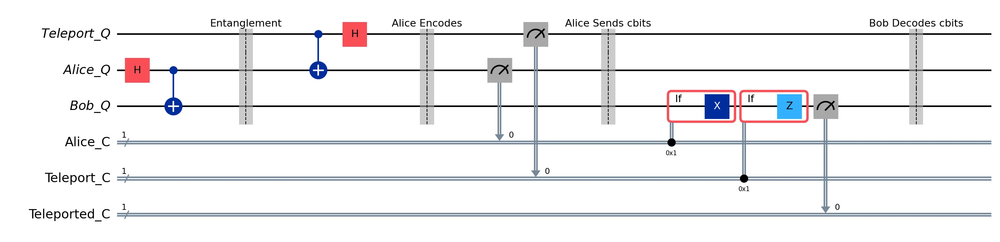
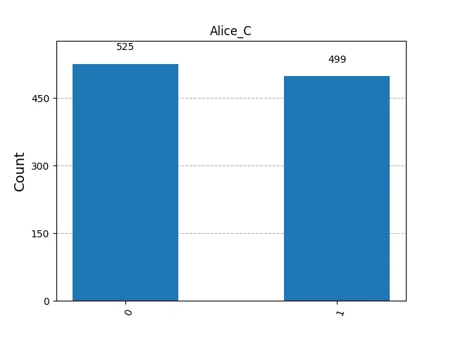
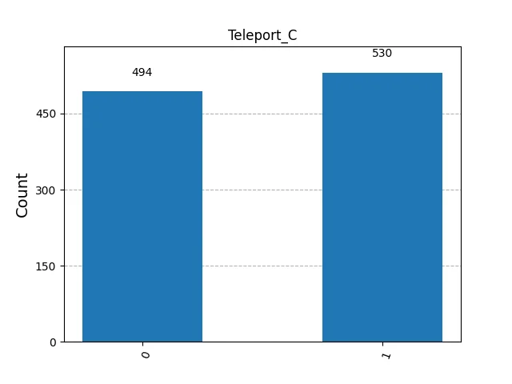
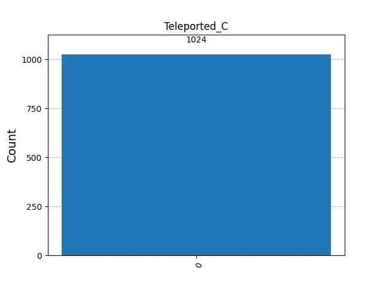
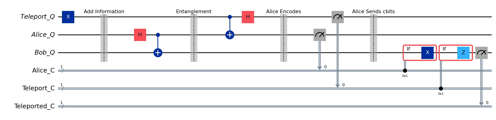
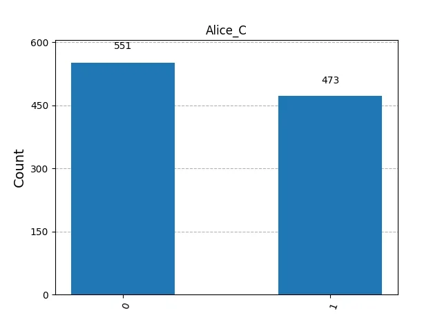
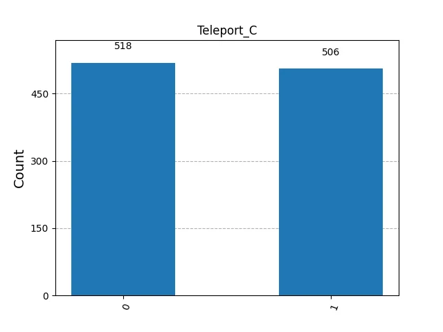
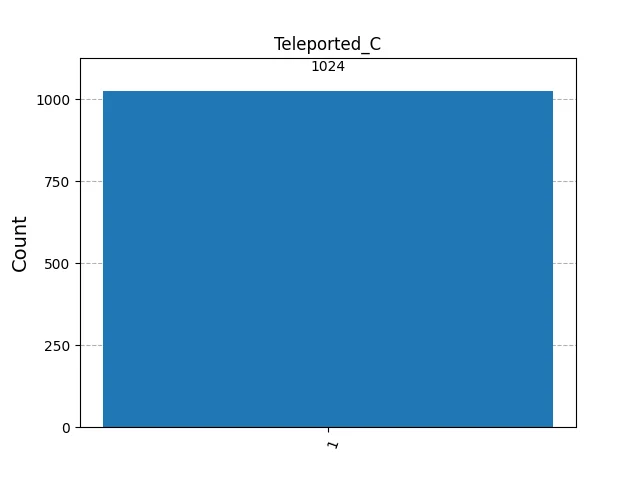

## Teleportation

Teleportation is a communication protocol that transfers quantum states between two ends. In classical systems, we can copy a state and easily encode, transfer, and decode it from one end to another. Quantum systems work differently — the **no-cloning theorem** [@wootters1982nocloning] proves that it is impossible to create an identical copy of an arbitrary unknown quantum state, ruling out any classical copy-and-send approach.

In addition, if we measure a qubit state, which could be in superposition, and then transfer the classical collapsed state, we do not improve network communication. Thus, teleportation uses the quantum mechanical principle of **entanglement** — first described by Einstein, Podolsky, and Rosen in 1935 [@einstein1935epr] — which acts as a communication channel without physical substrate.

Entanglement creates a correlated state between quantum systems in which the state cannot be decomposed or expressed as a tensor product of the individual states, hence the measurement of one affects the measurement of others. Since this effect is instantaneous regardless of distance, it is also called non-local. Using entanglement, teleportation can move a quantum state from one end to another without physically transferring anything.

However, since entangled states are equally distributed probabilistic states, the information remains saved but not directly accessible. The original teleportation protocol, proposed by Bennett et al. in 1993 [@bennett1993teleporting], solves this with a final classical step: measure the sender's qubits and communicate the classical results to the receiver.

The receiver then applies conditional operations based on the received classical bits to reconstruct the original state in a new qubit. The qubit entity no longer exists on the sender's side but only on the recipient's, respecting the no-cloning theorem [@wootters1982nocloning]. Finally, since classical information must still travel via classical networks — which cannot exceed the speed of light — teleportation and entanglement do not violate special relativity [@lapierre2021quantum].

## Teleportation in Qiskit

A 3-Qubit and 3-Cbit register represents the teleportation protocol in @fig-tc, with the following specification:

- **Teleport_Q**: Alice's Qubit to send to Bob

- **Alice_Q**: Alice's Qubit to be entangled

- **Bob_Q**: Bob's Qubit to be entangled

- **Alice_C**: Alice's Classical Bit for measuring Alice_Q

- **Teleport_C**: Alice's Classical Bit for measuring Teleport_Q

- **Teleported_C**: Bob's Classical Bit for receiving the teleported Teleport_Q

```{python}
#| eval: false

# Circuit Construction
teleport_qubit = QuantumRegister(1, 'Teleport_Q')
alice_qubit = QuantumRegister(1, 'Alice_Q')
bob_qubit = QuantumRegister(1, 'Bob_Q')
alice_cbit = ClassicalRegister(1, 'Alice_C')
teleport_cbit = ClassicalRegister(1, 'Teleport_C')
teleported_cbit = ClassicalRegister(1, 'Teleported_C')

teleportation = QuantumCircuit(
    teleport_qubit, alice_qubit, bob_qubit, alice_cbit, teleport_cbit, teleported_cbit, name='Teleportation')

# Init a value in Alice's Teleport_Q
teleportation.x(teleport_qubit)
teleportation.barrier(label='Add Information')

# Entangle Alice and Bob qubits
teleportation.h(alice_qubit)
teleportation.cx(alice_qubit, bob_qubit)
teleportation.barrier(label='Entanglement')

# Teleportation Sender/Alice Actions
teleportation.cx(teleport_qubit, alice_qubit)
teleportation.h(teleport_qubit)
teleportation.barrier(label='Alice Encodes')

teleportation.measure(alice_qubit, alice_cbit)
teleportation.measure(teleport_qubit, teleport_cbit)
teleportation.barrier(label='Alice Sends cbits')

# Bob uses the classical bits to conditionally apply gates
with teleportation.if_test((alice_cbit, 1)):
    teleportation.x(bob_qubit)
with teleportation.if_test((teleport_cbit, 1)):
    teleportation.z(bob_qubit)
teleportation.measure(bob_qubit, teleported_cbit)
teleportation.barrier(label='Bob Conditionally Decodes')

# Simulation in mimic h/w
backend = AerSimulator()
aer_mimic_simulation(teleportation, backend=backend, shots=1024)
```

The results of the measurement in @fig-am and @fig-bm below.

{#fig-tc}

::: {layout-ncol=2}
{#fig-am}


:::

{#fig-bm}

We can test the Teleportation Circuit by flipping the initial state of **Teleport_Q** qubit, from $|0\rangle$ to $|1\rangle$, and we should expect Bob's measurement to be 1, representing the teleported state of **Teleport_Q** to **Bob_Q** (@fig-ctt). We can validate Bob's Qubit state which flipped to $|1\rangle$. The results of the measurement in @fig-am2 and @fig-bm2 below.

{#fig-ctt}

::: {layout-ncol=2}
{#fig-am2}


:::

{#fig-bm2}

## References

::: {#refs}
:::

