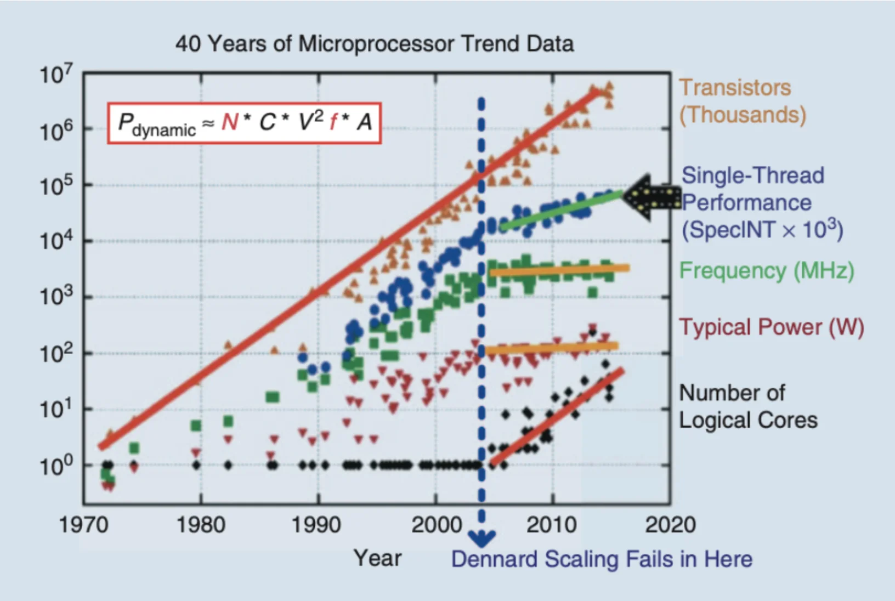
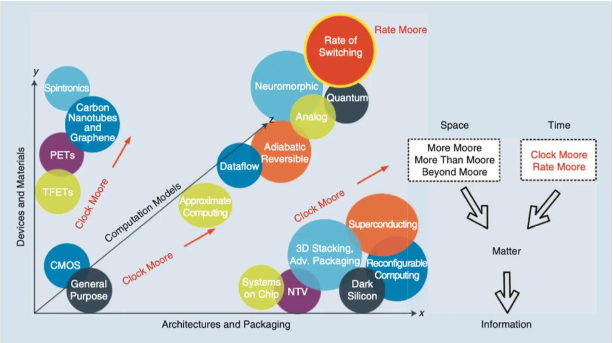

## Historical Background

From the beginning of our known time, human history is constantly changing. While this change can have good or bad effects on the cosmos, we can observe a definite technological evolution in how we understand nature during the evolution of time. In the film “[2001: A Space Odyssey](https://en.wikipedia.org/wiki/2001:_A_Space_Odyssey)”, Stanley Kubrick explores and more precisely *understands* a sequence of revolutionary periods in knowledge and advancements with a pattern of a mysterious “alien monolith” appearance, followed by intelligence advancements of the species that observed it. Scientists have categorized human history’s most major evolution and technological advancements into four Industrial Revolutions:

::: {#fig-revolutions}
![Four Industrial Revolutions. Source: World Economic Forum [@schwab2016]](./media/four_revolutions.webp){width=60%}
:::

We are now witnessing the rise of a Fourth Industrial Revolution, which builds upon the Third Industrial Revolution, also known as the digital revolution, that began in the mid-20th century. This new era is marked by a convergence of technologies that blur the physical, digital, and biological boundaries. There are three key reasons why today’s transformations signify the emergence of a distinct Fourth Industrial Revolution rather than a mere extension of the Third: velocity, scope, and systemic impact. 

The current rate of technological breakthroughs is unprecedented in history, advancing at an exponential rather than a linear pace. Furthermore, it is causing widespread disruption across nearly every industry and country. The extensive and profound nature of these changes is transforming entire systems of production, management, and governance.

But let us focus on the Third one to understand what enabled this exponential growth. While the reasons can be many, the exponential growth of technology in terms of computing power dictated the significant advances in sciences, Arts, and Culture. This exponential growth has predicted and sustained a tremendous tech industry, pushing the limits every year according to the well-known Moore’s Law. Currently, society depends on the rapid and affordable technology that Moore predicted in 1965.

The age of digital electronics began in 1947 when a research team at Bell Labs designed the first transistor, and the first commercially available Integrated Circuit (IC or Chip) appeared in 1961. In 1964, some chips had as many as 32 transistors, and when Moore wrote his article in 1965, a chip in his lab had 64. Hence, he noticed the complexity of the IC increment rate. A new economy was introduced based on this extraordinary rate of innovation. 

Apart from the economic impact, the computerization that started around the 90s reshaped the world. Productivity growth, linked directly with computer usage, established computers as the most important single technology, while this productivity growth led to improved living standards. Thus, we have built a tremendous tech industry to scale, spread, and embed technology in our day-to-day lives [@mannarchive2000].

### Moore's Law

Moore's Law is a techno-economic model that has enabled the industry to double the performance and functionality of digital electronics approximately every two years, within fixed cost and power. More precisely, it postulates that the level of chip complexity that can be manufactured for minimal cost is an exponential function that doubles in a period. It predicts that the cost of making any given integrated circuit at optimal transistor density levels is constant in time [@huff2008_ch1].

The optimal component density, for any given period $t$:

$$C_t = 2C_{t-1}$$

The Manufacturing cost per component $M$ in period $t$:

$$M_t = \frac{M_{t-1}}{2}$$

Moore's Law relies on the CMOS technology, and the prediction is based on the transistor's physical length scaling. Advances in Semiconductor Lithography enabled this scaling as the miniaturization of electronics, resulting in exponential computing power and affordable commercial tech. Currently, in 2024, we are counting transistors in hundreds of billions in typical ICs and measuring the size of transistors in one-digit nanometers. As transistors reach their atomic size limit, physical and economic constraints make it difficult to sustain Moore's Law. Challenges like quantum effects, heat dissipation, material limitations, and increasing fabrication costs required fundamental advances in computing, marking a new era of computing [@shalf2020].

Since the 1990s, the semiconductor industry has published the International Technology Roadmap for Semiconductors (ITRS) every two years to coordinate industry-wide efforts for advancement. However, in 2017, updates to the ITRS were discontinued, signaling the approaching end of conventional CMOS transistor scaling.

### Dennard Scaling

Apart from transistor scaling, another scaling area reached a limit. Dennard Scaling, named after Robert H. Dennard, first described the concept in a 1974 paper. Dennard Scaling refers to a critical principle in semiconductor design and microelectronics. It states that as transistors get smaller, their power density remains constant, meaning that the power consumption does not increase despite the transistors being more numerous and closer together. This is achieved by reducing the voltage and current in proportion to the linear dimensions of the transistors. 

Dennard Scaling allows for higher performance and efficiency in smaller spaces. However, in the mid-2000s, Dennard scaling failed, resulting in a stagnation of clock rate increases. The maximum clock speed stabilized at approximately 3–4 GHz, with power consumption peaking in the range of a few hundred watts (@fig-clock-speed). This limitation on clock frequency questions if there are innovative alternatives to the fixed-frequency clocking design strategy that has dominated IC design for decades. Moreover, it is challenging to determine if dynamic-frequency clocking is beneficial in applications whenever and wherever possible.

::: {#fig-clock-speed}
{width=60%}
:::

Moore also predicted this limitation in 2001: "I've learned to live with the term. But it's really not a law; it's a prediction. No exponential runs forever. The key has always been our ability to shrink dimensions and we will soon reach atomic dimensions, which are an absolute limit." [@huff2008_limit]. The industry continues to enhance device functionalities, summarized in the following strategies (@fig-future) [@xiu2019].

### Industry Strategies

#### Space

- **More Moore**: A near-term strategy focuses on continuous transistor scaling and miniaturization. Initially, as transistors shrank, they also became faster and more energy-efficient. However, Dennard Scaling broke down, halting clock speed increases due to heat dissipation issues. To continue performance improvements, the industry shifted to multi-core architectures and power-efficient designs, alongside innovations like strained silicon and 3D transistors, to use a large number of basic processing elements more efficiently as a whole.

- **More Than Moore**: A mid-term strategy integrating various technologies (e.g., sensors, memory, power management, communication modules) into a single system to enhance overall capabilities beyond individual transistors, as seen in modern smart home hubs (IoT devices). This approach also includes heterogeneous integration, which combines different technologies on a single chip using advanced packaging techniques for improved functionality and performance, exemplified by modern smartphones with integrated SoCs, sensors, modems, image processing modules, and PMICs. Additionally, More Than Moore tailors accelerator chip designs to specific applications, optimizing power consumption and processing speed, as seen in Application Specific Integrated Circuits (ASICs) such as GPUs, TPUs, and NPUs. This approach highlights that technological advancements are not solely driven by increased computing power but by enhanced system capabilities and tailored solutions.

- **Beyond Moore**: A long-term strategy exploring CMOS alternatives by moving beyond CMOS with advancements in ICs, with stack chips and Chiplet technology, to pack more transistors efficiently, like 3D chip stacking. In addition, it is investigating materials like graphene and carbon nanotubes, which are being considered for transistor channels and interconnects due to their superior properties, to surpass silicon limitations. It also includes novel computational paradigms as alternatives to traditional silicon-based transistors, such as quantum computing, neuromorphic computing, and optical computing. These approaches aim to overcome the limitations of conventional scaling by leveraging new technologies and architectures.

#### Time

The above strategies focus on space in terms of computation power growth. There are also two additional considerations for these paths to investigate more computing power from the time perspective. **Clock Moore** investigates dynamic-frequency clocking to enhance computing power. Meanwhile, **Rate Moore** proposes using time rather than space to encode information, suggesting new computational models prioritizing timing for increased efficiency. Over the past five decades, the semiconductor industry has primarily relied on electric charges (electron movement, represented as voltage and/or current) to encode information. This method requires matter and, consequently, space, as the amount of charge is virtually proportional to the size of the space [@xiu2019].

::: {#fig-future}
{width=60%}
:::

## Unconventional Computing

As the demand for more powerful and efficient computing systems grows, the cessation of Moore's Law, the constraints imposed by Dennard Scaling, and the Turing barrier have become increasingly apparent. Researchers are exploring Beyond Moore strategies to address these challenges, including Unconventional Computing, which presents promising alternatives to traditional digital computing paradigms.

Unconventional Computing encompasses diverse computational approaches that depart from reliance on binary logic, silicon-based technology, and von Neumann architectures. Instead, it leverages principles from various fields, such as quantum mechanics, neuromorphic engineering, optics, and spintronics. These innovative approaches can potentially revolutionize industries ranging from artificial intelligence and optimization to communication and cryptography.

The essence of Unconventional Computing lies in exploiting the physics of materials directly for computational operations. This approach involves representing information as physical quantities and utilizing materials' inherent physical dynamics and evolution for computation.

For instance, an origami computer, as depicted in a Quanta Magazine [article](https://www.quantamagazine.org/how-to-build-an-origami-computer-20240130/) (Quanta Magazine, 2024), illustrates how the properties of physical materials can be harnessed to perform computational tasks, embodying the core idea of Unconventional Computing.

The field seeks to develop new computing architectures using chemical, physical, and biological mechanisms and aims to uncover entirely different ways to compute, broadening our understanding of computation. A few paradigms are Quantum, Optical, Soliton, Spintronics, Reservoir, and DNA Computing. In recent years, heavy academic and experimental research has led to new computational models with cross-disciplines, combining multiple models of different scientific domains [@finocchio2024].

### Origins

The origins of Unconventional Computing trace back to the mid-20th century. Notable pioneers include Alan Turing, whose work on "The Chemical Basis of Morphogenesis" explored how natural patterns could inspire computational models. The 1980s marked significant advancements with Richard Feynman's foundational contributions to quantum computing, particularly his 1982 paper, "[Simulating Physics with Computers](https://link.springer.com/article/10.1007/BF02650179)," which laid the groundwork for utilizing quantum mechanics in computation. The 1990s saw further developments with Carver Mead's pioneering work in neuromorphic engineering, as detailed in his seminal paper, "[Neuromorphic Electronic Systems](https://ieeexplore.ieee.org/document/550663)." These early explorations laid the groundwork for today's diverse and interdisciplinary approaches, driving the continuous evolution of Unconventional Computing [@jaeger2023].

{#fig-road}

## References

::: {#refs}
:::
