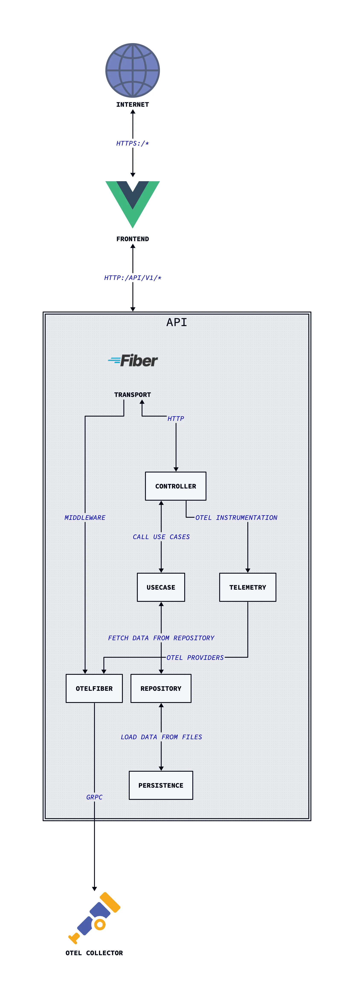

[Composer profile portfolio](https://github.com/ioaiaaii/ioaiaaii.net), as a self-managed BFF, serving a SPA from a Go HTTP Framework. The "personal website" framing is intentional: it's a living lab for practising Clean Architecture, full-signal observability, hermetic CI/CD, and GitOps delivery — end to end, in a real production environment.

::: {.callout-note}
- Deployed at [micro-infra](../cloud-micro-infra/index.qmd)
- Powered by [repo-operator](../cloud-repo-operator/index.qmd)
- [ioaiaaii.net](https://ioaiaaii.net/)
:::

## Architecture

::: {layout-nrow=1}
{#fig-arch width="40%"}
:::

The backend follows Clean Architecture with inward dependencies abstractions, hence the core never knows about actual frameworks or storage.

The Vue.js SPA is built by Vite at container build time and embedded directly into the Go binary via `go:embed`, and served by GOFiber HTTP Framework, in one binary.


### Tech Stack

| Layer | Tools |
|---|---|
| **Backend** | Go, Fiber v2 |
| **Frontend** | Vue.js 3, Vite, Tailwind CSS |
| **Observability** | OpenTelemetry(MELT), slog |
| **Packaging** | Docker (distroless, multi-stage), Kaniko, Dive, Hadolint |
| **CI/CD** | GitHub Actions, ArgoCD, Conventional Commits, git-chglog |
| **Security** | Trivy, GCP Workload Identity Federation (keyless auth) |
| **Deployment** | Helm, Kubernetes |
| **Tooling** | [repo-operator](https://github.com/ioaiaaii/repo-operator) (shared hermetic Makefile) |


### Design Decisions

#### Single binary BFF
The Go binary serves both the REST API and the embedded Vue.js SPA from the same process. This eliminates a separate static file server, simplifies the Kubernetes deployment (one Deployment, one Service, one Ingress), and keeps operational overhead minimal. Vite builds the frontend at container build time; `go:embed` packages the `dist/` output into the binary.

#### Clean Architecture
The use case layer has zero framework dependencies — it only depends on the repository interface. This means:

- Persistence is swappable (file today, database or object storage tomorrow) without touching the use case
- The HTTP layer (Fiber) is equally replaceable — a gRPC controller would plug into the same interface
- Use cases are trivially unit-testable with mocked repositories

#### In-memory cache with TTL
A 30-minute in-memory cache sits between the file storage and the use case. Content changes rarely; the cache is injected via the same repository interface — the use case is completely unaware of it. Swapping for Redis would require zero use case changes.

#### Full OTel from day one, with graceful degradation
The app initialises the full OpenTelemetry SDK on startup — traces, metrics, and logs all exported via OTLP/gRPC. If `OTEL_ENABLED` is not set, the SDK is skipped entirely and `slog` prints structured logs to stdout. The same binary works in local development (no collector) and in production (collector in-cluster) without any code changes.

#### Distroless runtime image
The final image is `gcr.io/distroless/static-debian12:nonroot` — no shell, no package manager, no libc. Dive consistently reports `>99.99%` efficiency with under 2 KB wasted. The build uses three stages: Node (Vite bundle) → Go (binary compilation with vendoring) → distroless (runtime only).

#### Keyless CI authentication
GitHub Actions authenticates to GCP via Workload Identity Federation. No service account keys are stored anywhere. The WIF pool is scoped to this specific repository. Kaniko builds and pushes images without a Docker daemon.


## Release Engineering

Four workflows in GitHub Actions, each with a single responsibility:

### Dependency caching *(on push to `master`)*
Keeps Go module and Trivy DB caches warm. The Trivy cache key is derived from the upstream DB SHA — it only refreshes when the vulnerability database actually changes.

### Pull request validation
Triggered on PRs touching Go, frontend, build, or workflow files:

```
PR opened
  ├── code-quality      (golangci-lint)
  ├── unit-tests        (go test)
  ├── security-scanning (Trivy fs scan, uses cached DB)
  └── package           (→ delegates to package.yaml)
```

### Reusable build & push *(callable workflow)*
1. Restores Go module cache
2. Authenticates to GCP via Workload Identity Federation
3. Builds and pushes with Kaniko to `europe-west3-docker.pkg.dev/micro-infra/micro-repo/ioaiaaii`

### Release *(on `v*` tag)*
1. Generates changelog from conventional commits via `git-chglog`
2. Creates a GitHub Release with the generated notes
3. Triggers `package.yaml` to build and push the release image
4. ArgoCD in `micro-infra` detects the new tag and deploys automatically

#### Release Process
1. Merge PRs to `master` following [Conventional Commits](https://www.conventionalcommits.org/)
2. Bump `appVersion` in `deploy/helm/ioaiaaii/Chart.yaml` to the new tag
3. Cut the tag: `git tag vX.X.X && git push --tags`
4. GitHub Actions builds the image and creates a GitHub Release with auto-generated changelog (like [this](https://github.com/ioaiaaii/ioaiaaii.net/releases/tag/v1.1.7) *pretty cool, right?*)
5. ArgoCD detects the new semver tag and rolls out automatically

**Planned**: Argo Rollouts for canary deployments with OTel-based analysis, Kargo for promotion pipelines.


## Observability

All three OTel signals are exported to the in-cluster OTel Collector via OTLP/gRPC:

| Signal | Implementation | Coverage |
|---|---|---|
| **Traces** | `otlptracegrpc` + `otelfiber` middleware | All HTTP requests automatically instrumented |
| **Metrics** | `otlpmetricgrpc` + Go runtime instrumentation | Request metrics + Go runtime stats |
| **Logs** | `otlploggrpc` via `otelslog` bridge | `slog` calls forwarded to OTel pipeline |

All three providers share the same OTel resource (`service.name = ioaiaaii-api`) and shut down gracefully with a configurable timeout on `SIGTERM`.

The **frontend** also instruments browser-side metrics via the OTel JS SDK (`otel-metrics.js`) with a fetch interceptor tracking API call performance.

**Planned**: exemplar linking (metrics → traces), Pyroscope profiling, SLO burn-rate alerting.


## Local Development

Prerequisites: `docker`, `make`, `node`, `go`

``` bash
# Initialise repo-operator submodule
git submodule update --init --recursive

# See all available targets
make help
```

### Development mode (hot reload)

``` bash
make local-dev
```

Starts the Vite dev server and Go backend in parallel. The frontend proxies API requests to the Go server.

### Production preview mode

``` bash
make local-preview
```

Builds the Vite bundle, embeds it, and serves the full BFF locally — identical to the production binary.

### Docker workflow

``` bash
make local-image-lint    # Hadolint on Dockerfile
make local-image-build   # Build image locally
make local-image-run     # Run container (auto-detects exposed port)
```

### Run OTel Collector locally

``` bash
make otel-ci    # Starts otelcol-contrib using build/ci/.otel-collector-config.yaml
```


### Configuration

All configuration is via environment variables with defaults:

| Variable | Default | Description |
|---|---|---|
| `API_HTTP_PORT` | `8080` | HTTP server listen port |
| `API_HTTP_SERVER_TIMEOUT` | `30` | Request timeout (seconds) |
| `API_HTTP_SERVER_SHUTDOWN_TIMEOUT` | `5` | Graceful shutdown timeout (seconds) |
| `OTEL_ENABLED` | *(unset)* | Set to `true` to enable OTel export |
| `OTEL_EXPORTER_OTLP_ENDPOINT` | *(unset)* | OTLP/gRPC collector endpoint |
| `OTEL_SERVICE_NAME` | `ioaiaaii-api` | Service name in OTel resource attributes |
| `OTEL_SHUTDOWN_TIMEOUT` | `10` | OTel SDK shutdown timeout (seconds) |

In-cluster, `OTEL_EXPORTER_OTLP_ENDPOINT` is set to `http://otel-collector.observability.svc.cluster.local:4317` via the Helm chart.


### API Reference

Full spec: [`api/OpenAPI/openapi.yaml`](https://github.com/ioaiaaii/ioaiaaii.net/blob/master/api/OpenAPI/openapi.yaml) · Generated docs: [`docs/api/README.md`](https://github.com/ioaiaaii/ioaiaaii.net/blob/master/docs/api/README.md)

| Endpoint | Description |
|---|---|
| `GET /api/v1/info` | Resume: profile, experience, education, skills |
| `GET /api/v1/releases` | Music releases |
| `GET /api/v1/live` | Live performance history |
| `GET /healthz/liveness` | Kubernetes liveness probe |
| `GET /healthz/readiness` | Readiness probe (validates data dependencies) |
