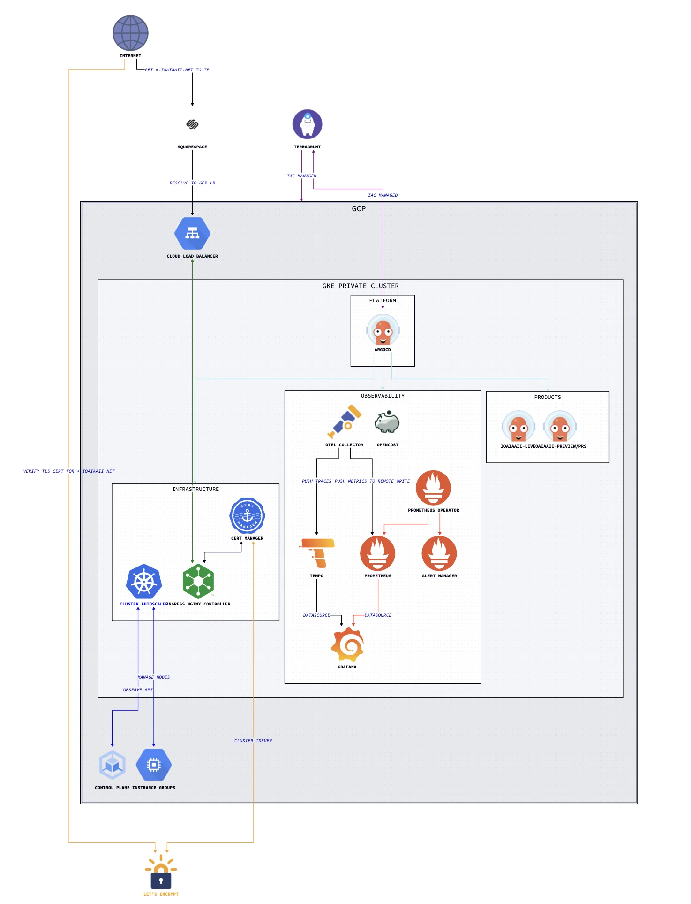

[micro-infra](https://github.com/ioaiaaii/micro-infra) is the single source of truth for a lightweight and complete cloud-native infrastructure platform. It demonstrates end-to-end ownership of the reliability stack: infrastructure provisioning, GitOps-driven deployment, full-signal observability, layered security, and cost attribution — with minimal operational toil by design.


## Architecture

::: {layout-nrow=1}
{#fig-arch width="70%"}
:::

The platform is organised into three distinct operational domains, each mapped to an ArgoCD Project with independent sync policies and RBAC:

| Domain | Namespace | Responsibility |
|---|---|---|
| `infrastructure` | `infrastructure` | Cert-manager, Ingress NGINX, Cluster Autoscaler, Harbor |
| `observability` | `observability` | Prometheus, Grafana, Tempo, OTel Collector, OpenCost |
| `products` | per-service | Application workloads and ephemeral PR preview environments |


## Bootstrap Flow

A single Terragrunt run takes a blank GCP project to a fully reconciled cluster:

```
Terragrunt
  └── Provisions GCP resources (VPC, GKE, IAM, bastion, storage)
        └── Installs ArgoCD via meta-argo-cd Helm chart
              └── Creates bootstrap Application
                    └── Syncs meta-charts/argocd-apps (App-of-Apps)
                          ├── Creates ArgoCD Projects (infrastructure, observability, products)
                          └── Creates App-of-Apps per project
                                ├── gitops/infrastructure/* → infrastructure components
                                ├── gitops/observability/* → full observability stack
                                └── gitops/domain/*        → product workloads + PR previews
```

After the bootstrap, ArgoCD owns all cluster state. No manual `kubectl` or `helm` commands are needed — the cluster continuously reconciles itself to HEAD.


## Repository Structure

```
micro-infra/
├── docs/                        # Architecture diagrams
├── iac/                         # Terragrunt IaC for GCP
│   └── gcp/
│       ├── terragrunt.hcl       # Root: remote state, Trivy security hook
│       └── micro-infra/
│           ├── project.hcl      # Project-level variables
│           └── europe-west3/
│               ├── location.hcl                    # Region/zone variables
│               ├── network/                        # VPC, Cloud Router + NAT
│               ├── compute-engine/bastion/         # IAP-tunnelled bastion
│               ├── kubernetes-engine/
│               │   ├── cluster/                    # GKE private cluster
│               │   ├── data/                       # GKE version data source
│               │   └── workloads/cluster-bootstrap/ # ArgoCD Helm install
│               ├── iam/
│               │   ├── service-accounts/           # github-runners, opencost
│               │   └── workload-identity-federation/ # Keyless OIDC auth
│               ├── cloud-storage/website-content/
│               └── project-factory/api-services/
├── gitops/                      # ArgoCD Application manifests
│   ├── infrastructure/
│   ├── observability/
│   └── domain/
├── meta-charts/                 # Helm wrapper charts
│   ├── meta-argo-cd/            # ArgoCD + bootstrap Application
│   ├── argocd-apps/             # App-of-Apps (Projects + ApplicationSets)
│   ├── cert-manager/            # LetsEncrypt + mTLS CA + client cert
│   ├── cluster-autoscaler/
│   ├── harbor/
│   ├── ingress-nginx/
│   ├── kube-prometheus-stack/   # Prometheus, Grafana, Alertmanager (CRDs split out)
│   ├── monitoring/              # Grafana dashboards + PrometheusRules
│   ├── otel-collector/
│   ├── opencost/
│   └── tempo/
├── runbooks/                    # Operational runbooks
├── scripts/                     # Utility and test scripts
└── repo-operator/               # Submodule: shared hermetic Makefile targets
```


## Design Decisions

These are the deliberate trade-offs that shaped the platform, not just the defaults.

### Self-managed observability over Cloud Ops
GKE's managed monitoring and logging are explicitly disabled. The platform runs its own Prometheus, Grafana, Tempo, and OTel Collector stack. This gives full control over retention, cardinality, alerting logic, and cost — at the expense of some operational overhead. The overhead is bounded: all components are ArgoCD-managed and self-healing.

### CRD lifecycle decoupled from operator upgrades
`kube-prometheus-stack` CRDs are managed as a separate ArgoCD Application (wave 2), using `ServerSideApply=true` and `Replace=true`. This prevents the well-known Helm CRD upgrade problem: Helm only installs CRDs on first deploy and silently skips updates on upgrades. Decoupling ensures the CRD schema is always in sync with the operator version.

### Spot instances throughout
Both node pools (`workers-base-pool` and `infrastructure`) use GCP spot (preemptible) instances. Combined with OpenCost for cost attribution and the Cluster Autoscaler for right-sizing, this significantly reduces compute cost. The platform is designed to tolerate node preemption: ArgoCD self-heals, stateless workloads reschedule, and the infrastructure node pool is isolated via taints so critical components aren't disrupted by workload churn.

### Keyless CI/CD authentication
GitHub Actions CI authenticates to GCP via Workload Identity Federation — no long-lived service account keys exist anywhere. The WIF pool is scoped to a specific GitHub organisation ID and repository, limiting blast radius. The same pattern is applied for OpenCost's GCP billing API access.

### Private cluster with IAP bastion
No public endpoints. The GKE control plane is private (`172.16.0.0/28`), nodes have no external IPs, and cluster access requires an IAP-tunnelled SSH session through a bastion VM. The bastion can be stopped when not in use, reducing attack surface to zero during idle periods.

### ArgoCD sync waves for ordered reconciliation
Deployment ordering is enforced via sync waves rather than manual sequencing:

| Wave | Applications | Reason |
|---|---|---|
| `1` | cert-manager, cluster-autoscaler | Must exist before anything that needs TLS or scales nodes |
| `2` | ingress-nginx, kube-prometheus-stack-crds | Ingress before exposed services; CRDs before the operator |
| `3` | kube-prometheus-stack, tempo, otel-collector, opencost | Backends after CRDs are established |

### Meta-charts pattern
Rather than pointing ArgoCD directly at upstream Helm repositories, every component is wrapped in a local "meta-chart" — a thin Helm chart with a single upstream dependency and a `values.yaml` override. This gives version pinning, values in source control, and a clean ArgoCD sync target, without forking upstream charts.


## IaC Layer (Terragrunt)

### GCP Resources

| Module | Resource |
|---|---|
| `network/vpc` | VPC with primary subnet `10.10.0.0/20`, pod range `192.168.0.0/18`, service range `192.168.64.0/18` |
| `network/router` | Cloud Router + NAT (outbound internet for private nodes) |
| `compute-engine/bastion` | IAP-accessible bastion VM |
| `kubernetes-engine/cluster` | Private zonal GKE cluster, `europe-west3-a` |
| `kubernetes-engine/workloads/cluster-bootstrap` | ArgoCD, Helm-installed via Terragrunt `null_resource` with SHA-based drift detection |
| `iam/service-accounts` | Dedicated SAs for github-runners and opencost |
| `iam/workload-identity-federation` | OIDC pools for keyless auth (GitHub Actions + OpenCost) |
| `cloud-storage/website-content` | GCS static hosting |
| `project-factory/api-services` | GCP API enablement |

### Variable Cascade

``` bash
iac/gcp/terragrunt.hcl        ← root: remote state backend, Trivy hook
  └── project.hcl             ← project = "micro-infra"
        └── location.hcl      ← region = "europe-west3", zones = ["europe-west3-a"]
```

All child modules inherit variables via `find_in_parent_folders()`. State is stored in GCS, keyed by module path.

### Automated Security Scanning

Trivy runs on every `plan`, `apply`, and `destroy` via a Terragrunt `after_hook`. The plan is rendered to JSON and scanned for misconfigurations before any changes are applied or confirmed:

``` bash
after_hook "security_scan" {
  commands = ["plan", "apply", "destroy"]
  execute  = ["bash", "-c",
    "terraform plan -out tmp_plan.out ... && trivy config tmp_plan.json ..."
  ]
}
```


## Observability

### Signal Coverage

| Signal | Collection | Storage |
|---|---|---|
| Metrics | Prometheus `ServiceMonitor` CRDs + OTel Collector | Prometheus |
| Traces | OTel Collector (OTLP receiver) | Tempo |
| Costs | OpenCost (GCP WIF billing access) | Prometheus |
| Logs | — | *(planned: Loki or similar)* |
| Profiling | — | *(planned: Pyroscope)* |

NGINX Ingress is [OTel-instrumented](https://kubernetes.github.io/ingress-nginx/user-guide/third-party-addons/opentelemetry/), emitting traces for all inbound HTTP traffic automatically.

### Grafana Dashboards

Custom dashboards are bundled in `meta-charts/monitoring/` and deployed as ConfigMaps, automatically provisioned by Grafana:

- Kubernetes API enhanced monitoring
- Cluster Autoscaler activity
- NGINX Ingress + request handling performance
- OpenCost detailed cost overview

### SLO Reporting *(planned)*

Sloth or OpenSLO for automated SLO burn-rate alerting — currently evaluated.


## Product Delivery

### Continuous Deployment

`ioaiaaii-live` tracks semver tags (`>=v0.0.0`) on the application repo, deploying to the `ioaiaaii-live` namespace with automated pruning and self-healing.

### PR Preview Environments

An `ApplicationSet` with a `pullRequest` generator watches for PRs labelled `preview`. For each matching PR, ArgoCD automatically:

- Creates a dedicated namespace `ioaiaaii-{branch}-{pr}`
- Deploys the branch Helm chart with a dynamic hostname `{branch}.ioaiaaii.net`
- Provisions a LetsEncrypt TLS certificate via cert-manager
- Prunes the entire environment when the PR closes

This enables full-stack preview environments with zero platform-team toil per deployment.


## Security

### Network Security
- **ModSecurity WAF** on NGINX Ingress with OWASP CRS `v4.4.0` — detects and blocks protocol attacks, injection attempts, and malformed requests at the ingress layer
- **mTLS** for private services (e.g. ArgoCD UI): cert-manager issues a private CA; clients must present valid certificates
- **Rate limiting** via NGINX annotations on all public-facing ingresses
- **Ingress hardening** per the official [NGINX Hardening Guide](https://kubernetes.github.io/ingress-nginx/deploy/hardening-guide/)

### Identity & Access
- **Workload Identity Federation** — keyless OIDC auth for GitHub Actions CI and OpenCost; no long-lived credentials
- **Private cluster** — no public node or API server endpoints
- **Shielded Nodes + Secure Boot** — enabled on all node pools

### IaC & Runtime
- **Trivy** — automatic misconfiguration scanning on every Terraform operation
- **Falco** — runtime threat detection *(planned)*


## Operations

### Accessing the Cluster

```bash
# Start bastion
gcloud compute instances start "bastion-vm" --zone "europe-west3-a"

# Open IAP tunnel
gcloud compute ssh --zone "europe-west3-a" "bastion-vm" \
  --tunnel-through-iap --project "micro-infra" \
  -- -L 8888:localhost:8888 -N -q -f

# Route kubectl through the tunnel
export HTTPS_PROXY=localhost:8888
gcloud container clusters get-credentials ioaiaaii --location europe-west3-a --internal-ip

# Stop bastion when done
gcloud compute instances stop "bastion-vm" --zone "europe-west3-a"
```

### Runbooks

| Runbook | Description |
|---|---|
| [Prometheus Operator CRDs Upgrade](https://github.com/ioaiaaii/micro-infra/blob/main/runbooks/operations/prometheus-operator/crds-upgrade.md) | Updating CRDs independently of the operator chart |

### Makefile

`repo-operator` is included as a submodule. Initialise after a fresh clone:

```bash
git submodule update --init --recursive
make help
```


## Prerequisites

```bash
# Install GKE auth plugin
gcloud components install gke-gcloud-auth-plugin

# Enable required GCP APIs
gcloud services enable \
  container.googleapis.com \
  compute.googleapis.com \
  cloudresourcemanager.googleapis.com \
  iap.googleapis.com

# Authenticate
gcloud auth application-default login
gcloud config set project micro-infra
```

Required tools: `terraform >= 1.9`, `terragrunt >= 0.68`, `helm`, `kubectl`, `trivy`, `yq`
