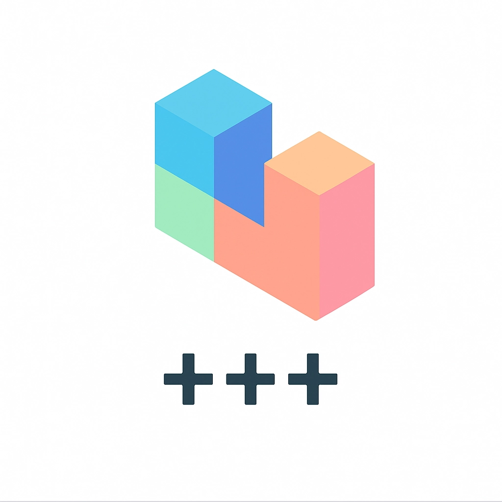

::: {layout-nrow=1}
{#fig-logo width="40%"}
:::

[`repo-operator`](https://github.com/ioaiaaii/repo-operator) is a modular and extensible repository management tool
that streamlines development workflows by providing reusable,
Docker-based, hermetic Makefile targets for common tasks. This ensures
that all builds, tests, and operations are fully isolated and
reproducible, regardless of the local environment. The project can be
added as a Git submodule and used to manage operations like building,
testing, and generating documentation across multiple repositories.


## Background

The name and design of `repo-operator` draw from two concepts in mathematics and physics.

**Hermeticity** (Hermitian operators) comes from linear algebra and quantum mechanics. A Hermitian operator is self-adjoint — equal to its own conjugate transpose. 
In quantum mechanics, Hermitian operators represent observable quantities and carry a crucial property: they always produce real, stable eigenvalues. No matter how you apply them, the output is consistent and well-defined.

This maps directly to hermetic builds into the Site Reliability Engineering: a target that produces the same output regardless of who runs it, on what machine, at what time. The operator acts on the input and yields a predictable, stable result — self-contained, with no side-effects leaking in from the environment.

**Non-locality** in quantum mechanics describes how entangled particles influence each other regardless of the distance between them. In mathematics, non-local operators act on a function's values across an *entire domain*, rather than at a single point.

This is the submodule model: a single change to `repo-operator` propagates to every repository that includes it, regardless of where those repos live. The operator is defined once; its effects are non-locally *real*.


## The Problem

Every project ends up with the same boilerplate: `Makefile` targets for
building, testing, linting, generating docs, managing Docker images. The
targets accumulate organically, drift between repos, and quietly break
when a tool version changes on someone's machine.

`repo-operator` solves this by treating your development tooling as a
versioned dependency. You pull it in as a Git submodule, `include` the
Makefiles you need, and every target runs inside a pinned Docker
container — identical on every machine, every time. In addition, repo-operator provides an *interface* to treat these targets as reusable and configurable functions across different projects.


## Repository Structure

```
repo-operator/
├── makefiles/
│   ├── base.mk           # Core variables, help, environment, gitignore, pre-commit sync
│   ├── changelog.mk      # Conventional commit linting and changelog generation
│   ├── golang.mk         # Go build, test, lint
│   ├── helm.mk           # Helm chart testing
│   ├── openapi.mk        # OpenAPI → Markdown doc generation
│   ├── otel.mk           # OpenTelemetry collector for local CI
│   ├── package.mk        # Docker build, push, run, Kaniko, Dive
│   └── security.mk       # Trivy vulnerability scanning
│
├── pre-commit-hooks/
│   ├── base.yaml         # General hooks (merge conflicts, line endings, private keys…)
│   ├── helm.yaml         # helm-docs auto-documentation
│   └── terragrunt.yaml   # Terraform/Terragrunt fmt, validate, tflint
│
├── gitignore/
│   ├── Go.gitignore
│   ├── macOS.gitignore
│   └── terragrunt.gitignore
│
├── scripts/
│   ├── gitignore_sync.sh     # Merges gitignore templates into your project's .gitignore
│   └── precommit_sync.sh     # Merges pre-commit hook configs into .pre-commit-config.yaml
│
└── Makefile              # repo-operator's own Makefile (uses base.mk + openapi.mk)
```


## Getting Started

### Prerequisites

- `docker`
- `make`
- `git`

### 1. Add as a submodule

Add `repo-operator` at any path that fits your project. For Go projects following the [standard project layout](https://github.com/golang-standards/project-layout), `build/` is the conventional home for build/CI tooling:

``` bash
git submodule add https://github.com/ioaiaaii/repo-operator.git build/repo-operator
```

### 2. Initialise on a fresh clone

``` bash
git submodule update --init --recursive
```

### 3. Configure your root `Makefile`

Include only the modules relevant to your project:

``` makefile
# --- Override repo-operator defaults ---
override OPERATOR_PATH     := build/repo-operator
override OPENAPI_FILE      := api/OpenAPI/openapi.yaml
override OPENAPI_DOCS_PATH := docs/api

# --- Include the modules you need ---
include ${OPERATOR_PATH}/makefiles/base.mk
include ${OPERATOR_PATH}/makefiles/golang.mk
include ${OPERATOR_PATH}/makefiles/openapi.mk
include ${OPERATOR_PATH}/makefiles/package.mk
include ${OPERATOR_PATH}/makefiles/security.mk
include ${OPERATOR_PATH}/makefiles/changelog.mk
```

### 4. Explore available targets

``` bash
make help
```

### 5. Sync gitignore and pre-commit hooks

``` bash
make gitignore        # Merges Go, macOS, terragrunt templates into .gitignore
make pre-commit-hooks # Merges hook configs into .pre-commit-config.yaml
```

### 6. Keep the submodule up to date

Track the latest commit on `master`:

``` bash
git submodule update --remote build/repo-operator
git add build/repo-operator
git commit -m "chore: bump repo-operator submodule"
```

Or pin to a specific release tag instead:

``` bash
cd build/repo-operator
git fetch --tags
git checkout v1.2.3
cd -
git add build/repo-operator
git commit -m "chore: pin repo-operator to v1.2.3"
```

The parent repo records the submodule's commit SHA — bumping the submodule and committing in the parent are two separate steps.


## Makefile Modules

All targets run inside **pinned Docker containers** — no local toolchain required beyond `docker` and `make`.

### `base.mk`

Core variables and shared utilities. **Always include this first.**

| Target | Description |
|---|---|
| `help` | Auto-generated target list from all included `.mk` files |
| `environment` | Print current Git tag, branch, version, Go path and version |
| `gitignore` | Merge `gitignore/` templates into the project's `.gitignore` |
| `pre-commit-hooks` | Merge `pre-commit-hooks/` configs into `.pre-commit-config.yaml` |
| `pre-commit-hooks-list` | List available pre-commit hook config files |


Key variables set in `base.mk`: `MODULE`, `COMMIT`, `TAG`, `BRANCH`, `VERSION`, `SRC`, `BUILD_PATH`, `DEPLOY_PATH`, and shared Docker command wrappers (`UBUNTU_CMD`, `HELM_CONTAINER_CMD`, `CT_CONTAINER_CMD`).

---

### `golang.mk`

Hermetic Go build and quality targets. No local Go installation needed.

| Target | Description |
|---|---|
| `go-mod-update` | Update all Go dependencies to latest |
| `go-mod-sync` | Run `go mod tidy`, `vendor`, and `verify` |
| `go-lint` | Run `golangci-lint` with your CI config |
| `go-test` | Run the full test suite |
| `go-build` | Build a Linux/amd64 binary with version ldflags injected |


The binary is stamped at build time with `BuildVersion`, `BuildHash`, and `BuildTime` via ldflags — expects a `pkg/version` package in your module.

---

### `changelog.mk`

Conventional commit enforcement and automated changelog generation.

| Target | Description |
|---|---|
| `conventional-commit-lint` | Lint commit messages from `origin/master` to `HEAD` |
| `conventional-changelog` | Generate `CHANGELOG.md` (runs lint first) |
| `conventional-changelog-release` | Generate changelog for a specific tag (for GitHub release notes) |


Expects a commitlint config at `build/changelog/.commitlintrc.yml` and a git-chglog config at `build/changelog/config.yml`.

---

### `helm.mk`

Helm chart linting via `chart-testing`.

| Target | Description |
|---|---|
| `chart-testing` | Run `ct lint` against all charts |


Expects a chart-testing config at `build/ci/.chart-testing.yaml`. Charts should live under `deploy/`.

---

### `openapi.mk`

Generate human-readable API documentation from an OpenAPI spec.

| Target | Description |
|---|---|
| `generate-docs` | Run `openapi-generator` to produce Markdown docs |


| Variable | Description |
|---|---|
| `OPENAPI_FILE` | Path to your `openapi.yaml` spec file |
| `OPENAPI_DOCS_PATH` | Output directory for generated Markdown |


---

### `otel.mk`

Spin up a local OpenTelemetry Collector for CI or local observability testing.

| Target | Description |
|---|---|
| `otel-ci` | Start `otelcol-contrib` with your config, exposing standard OTLP ports |


Expects a collector config at `build/ci/.otel-collector-config.yaml`. Ports exposed: `4317` (gRPC), `4318` (HTTP), `8888`, `8889`, `1888`, `13133`.

---

### `package.mk`

Full Docker image lifecycle management.

| Target | Description |
|---|---|
| `image-lint` | Run `hadolint` on a Dockerfile |
| `docker-image` | Build a Docker image tagged with the sanitised `VERSION` |
| `docker-push` | Tag and push the image to a registry |
| `docker-run` | Run a container, auto-detecting the exposed port and creating a named network |
| `kaniko-docker-image` | Build and push via Kaniko (supports GCP Workload Identity and local gcloud credentials) |
| `dive-ci` | Inspect image layers and efficiency with `dive` in CI mode |


Dynamic arguments:

``` bash
make docker-image  DOCKER_IMAGE=my-service
make docker-push   DOCKER_IMAGE=my-service DOCKER_IMAGE_REPO=registry.example.com/myorg
make docker-run    DOCKER_IMAGE=my-service
make kaniko-docker-image DOCKER_IMAGE=my-service DOCKER_IMAGE_REPO=gcr.io/my-project
make dive-ci       DOCKER_IMAGE=my-service
```

Dockerfiles are expected at `${BUILD_PATH}/package/${DOCKER_IMAGE}/Dockerfile`. The `docker-image` target injects `LD_FLAGS` as a build arg for Go binary stamping.

---

### `security.mk`

Vulnerability scanning with Trivy.

| Target | Description |
|---|---|
| `trivy-scan` | Run Trivy scanner, accepts arbitrary Trivy args |


``` bash
make trivy-scan TRIVY_ARGS="fs --exit-code 1 --severity HIGH,CRITICAL ."
```


## Pre-commit Hook Templates

`repo-operator` ships three composable hook configs. Running `make pre-commit-hooks`
merges them into your project's `.pre-commit-config.yaml`, skipping any entries
already present.

| File | Hooks included |
|---|---|
| `base.yaml` | Large file checks, merge conflict detection, private key detection, line ending normalisation, executable shebangs |
| `helm.yaml` | `helm-docs` — auto-generates chart README from `values.yaml` |
| `terragrunt.yaml` | `terraform-fmt`, `terraform-validate`, `tflint`, `shellcheck`, `terragrunt-hclfmt` |


## Gitignore Templates

Running `make gitignore` merges these templates into your project's `.gitignore`,
skipping any lines already present:

- `Go.gitignore`
- `macOS.gitignore`
- `terragrunt.gitignore`


## Customisation

Override any variable before the `include` statements:

``` makefile
override OPERATOR_PATH     := build/repo-operator
override SRC               := .
override BUILD_PATH        := build
override DEPLOY_PATH       := deploy
override OPENAPI_FILE      := api/openapi.yaml
override OPENAPI_DOCS_PATH := docs/api
override KUBECONFIG        := path/to/kubeconfig  # optional, for helm targets
```

### Adding your own targets

Annotate with `##` and they appear automatically in `make help`:

``` makefile
include ${OPERATOR_PATH}/makefiles/base.mk

## Run database migrations
.PHONY: migrate
migrate:
	./scripts/migrate.sh
```
