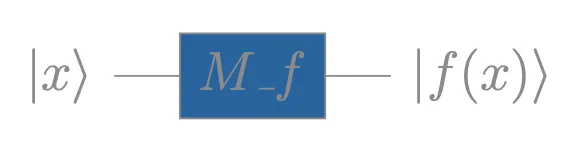
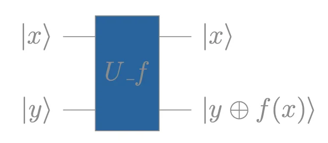
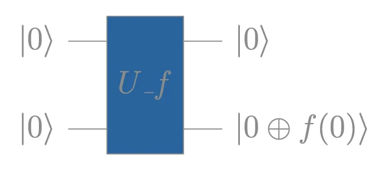
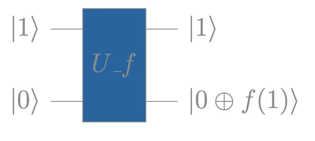
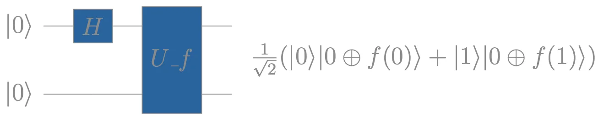
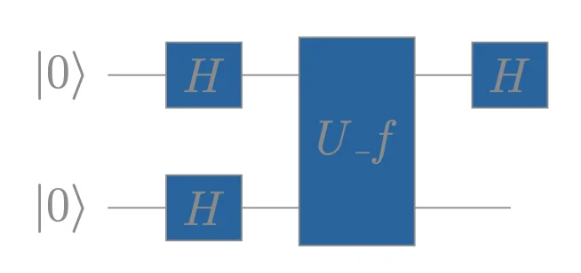
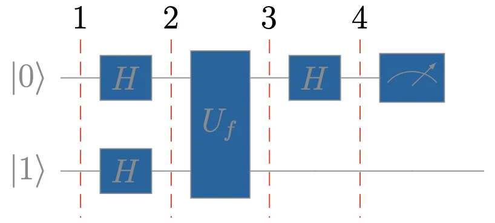
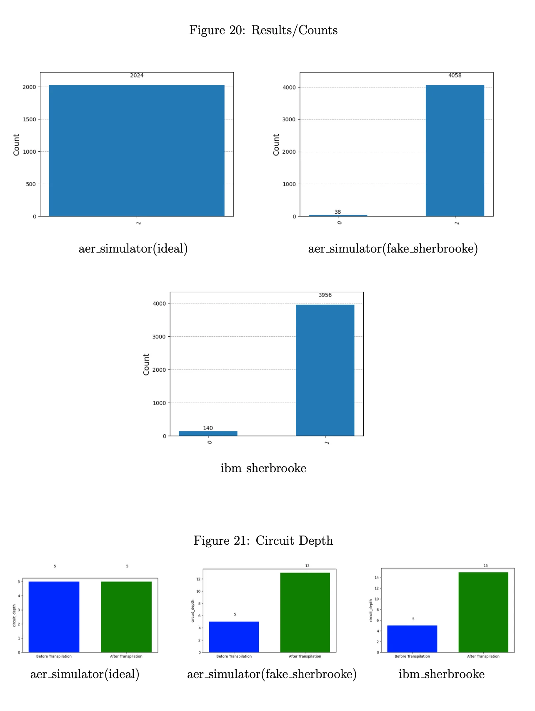
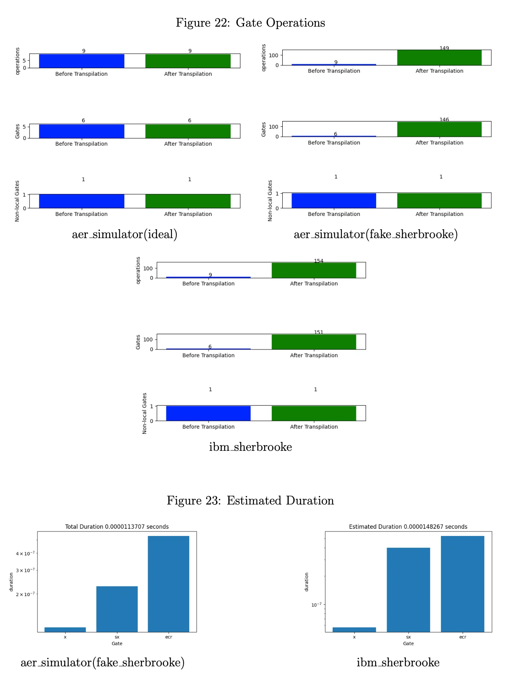
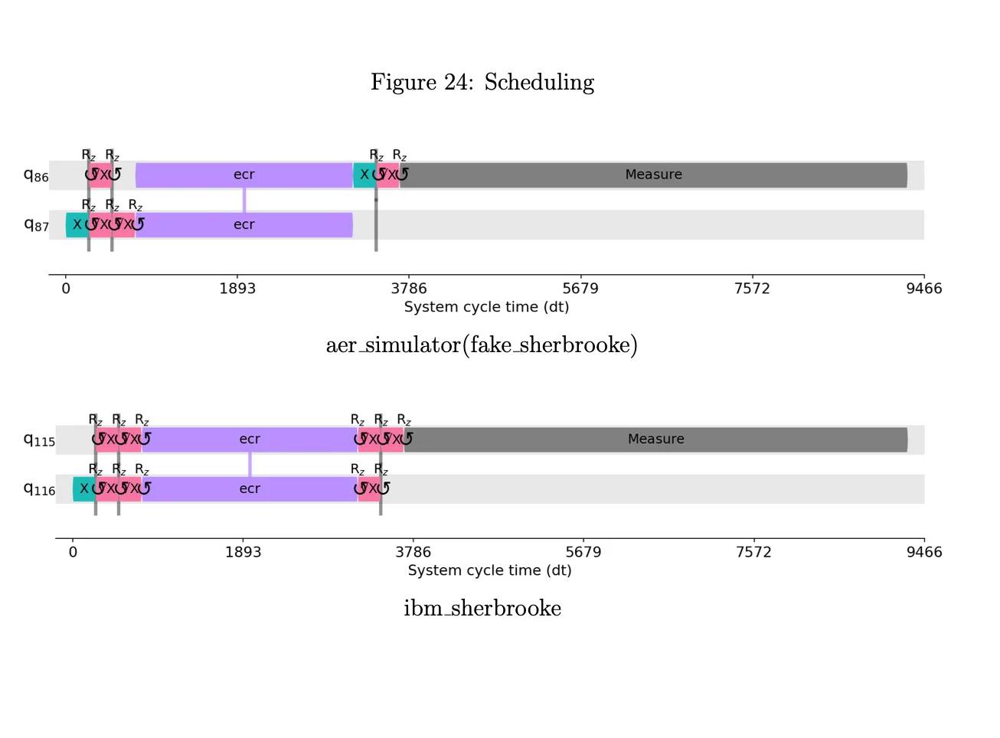

```{python}
#| echo: false
from qiskit import QuantumCircuit, QuantumRegister
from qiskit.circuit import Gate
import matplotlib.pyplot as plt
plt.rcParams['figure.figsize'] = [6, 2]
plt.rcParams['figure.dpi'] = 120
```

# Analysis of Deutsch's Algorithm {#analysis-of-deutschs-algorithm .unnumbered}

David Deutsch and Richard Jozsa's algorithm is a quantum algorithm that solves a specific problem more efficiently than any classical algorithm. It was one of the first examples to demonstrate the potential of quantum computing to outperform classical computing for certain tasks, back in 1992.

*Deutsch's Problem:*

Given a black-box function $f:\{0,1\} \to \{0,1\}$, determine whether it is *constant* when it returns the same output for both inputs, or *balanced*, when it returns different outputs. 

In classical computing, we can form the unitary operator $M_f$ for 1 (qu)bit, to model the computation of $f(x)$, with the following truth table @tbl-boolean-functions:

| $x$ | $f_0$ | $f_1$ | $f_2$ | $f_3$ |
|:---:|:-----:|:-----:|:-----:|:-----:|
|  0  |   0   |   1   |   0   |   1   |
|  1  |   0   |   1   |   1   |   0   |

: The four versions of $f(x)$ {#tbl-boolean-functions}


::: {layout-nrow=1}
{#fig-unary-gate fig-alt="Unary Gate $f$" width="40%"}
:::


Therefore:

- $f_0, f_1$ are **constant**

- $f_2, f_3$ are **balanced** ($f(0) \neq f(1)$).


Forming the two outputs as a bit string $f(x)\,f(x)$, with $x:\{0,1\}$ :

$$f_0 \to 00, \quad f_1 \to 11, \quad f_2 \to 01, \quad f_3 \to 10$$

The XOR pattern appears, and we can use the binary addition to distinguish them from their outputs. We "XOR" the two bits to a single-bit discriminator:

$$f(0) \oplus f(1) = \begin{cases} 0 & \text{if } f \text{ is constant} \\ 1 & \text{if } f \text{ is balanced} \end{cases}$$

Classically, computing $f(0) \oplus f(1)$ requires two queries, one for each input.

Deutsch's algorithm answers the question with a single execution by exploiting superposition of states for quantum parallelism and phase-kickback.

## Building the Oracle

From the $M_f$ truth table @tbl-boolean-functions, we can represent each unary operator as a matrix, where the columns are the output states for each input. The output states are the basis states $|0\rangle$ and $|1\rangle$: 

$$
M_{f_0} = \begin{bmatrix}1 & 1 \\ 0 & 0\end{bmatrix} \quad
M_{f_1} = \begin{bmatrix}0 & 0 \\ 1 & 1\end{bmatrix} \quad
M_{f_2} = \begin{bmatrix}1 & 0 \\ 0 & 1\end{bmatrix} \quad
M_{f_3} = \begin{bmatrix}0 & 1 \\ 1 & 0\end{bmatrix}
$$


In Quantum Computing, an operator $\hat{U}$, transforms an initial input state $\ket{\psi_i}$ to an output state $\ket{\psi_f}$:

$$
\hat{U}\ket{\psi_i} = \ket{\psi_f}
$$

The states, are the column vectors representing the quantum states, which are actually their probability amplitudes. 

Quantum operators are Unitary transformations with $\hat{U}^\dagger = \hat{U}^{-1}$. Therefore are also reversible. Given an output state $\ket{\psi_f}$, we can find the corresponding input state $\ket{\psi_i}$.

However, $M_{f_0}$ and $M_{f_1}$ are not unitary since $M_{f_0}^\dagger M_{f_0} \neq I$ and $M_{f_1}^\dagger M_{f_1} \neq I$. The constant functions map two distinct inputs (0 and 1) to the same output.

We need another qubit to generate a Unitary Matrix for the Oracle with all f functions. By
adding another qubit from the CNOT pattern, we can have the first qubit as input and the
second as output of f(x).

Therefore the quantum circuit in operator form can be defined as:

$$U_f\ket{x}\ket{y} = \ket{x}\ket{y \oplus f(x)}$$


::: {layout-nrow=1}
{#fig-unary-gate fig-alt="Unitary Gate $f$" width="40%"}
:::


The XOR construction makes $U_f$ self-inverse and therefore unitary for all four functions:

$$U_f^2\ket{x}\ket{y} = U_f\ket{x}\ket{y \oplus f(x)} = \ket{x}\ket{y \oplus f(x) \oplus f(x)} = \ket{x}\ket{y}$$

The oracle matrix columns are read from the truth table of $U_f\ket{x}\ket{y}$:

| $\ket{x}\ket{y}$ | $U_{f_0}$ | $U_{f_1}$ | $U_{f_2}$ | $U_{f_3}$ |
|:---:|:---:|:---:|:---:|:---:|
| $\ket{00}$ | $\ket{00}$ | $\ket{01}$ | $\ket{00}$ | $\ket{01}$ |
| $\ket{01}$ | $\ket{01}$ | $\ket{00}$ | $\ket{01}$ | $\ket{00}$ |
| $\ket{10}$ | $\ket{10}$ | $\ket{11}$ | $\ket{11}$ | $\ket{10}$ |
| $\ket{11}$ | $\ket{11}$ | $\ket{10}$ | $\ket{10}$ | $\ket{11}$ |

: Truth table for $U_f$ {#tbl-truth-table}

From @tbl-truth-table, the oracle matrices are:

$$
U_{f_0} =
\begin{bmatrix}
1 & 0 & 0 & 0 \\
0 & 1 & 0 & 0 \\
0 & 0 & 1 & 0 \\
0 & 0 & 0 & 1
\end{bmatrix}
=
\begin{bmatrix}
I & 0 \\
0 & I
\end{bmatrix}
\quad
U_{f_1} =
\begin{bmatrix}
0 & 1 & 0 & 0 \\
1 & 0 & 0 & 0 \\
0 & 0 & 0 & 1 \\
0 & 0 & 1 & 0
\end{bmatrix}
=
\begin{bmatrix}
X & 0 \\
0 & X
\end{bmatrix}
\quad
$$

$$
U_{f_2} =
\begin{bmatrix}
1 & 0 & 0 & 0 \\
0 & 1 & 0 & 0 \\
0 & 0 & 0 & 1 \\
0 & 0 & 1 & 0
\end{bmatrix}
=
\begin{bmatrix}
I & 0 \\
0 & X
\end{bmatrix}
\quad
U_{f3} =
\begin{bmatrix}
0 & 1 & 0 & 0 \\
1 & 0 & 0 & 0 \\
0 & 0 & 1 & 0 \\
0 & 0 & 0 & 1
\end{bmatrix}
=
\begin{bmatrix}
X & 0 \\
0 & I
\end{bmatrix}
$$

## The Circuit
In formulating the problem, we can use the first qubit as the first part of the binary addition since it will leave the second part un-flipped (XOR). We need to execute the circuit classically twice, $x \in \{0,1\}$:

::: {layout-ncol=2}

{#fig-unary-gate width="80%"}

{#fig-unary-gate width="80%"}

:::

Using Quantum Parallelism in the target qubit, which queries the f function, we can
calculate both steps in one by applying a Hadamard Gate $H$ to the control qubit. This will create a superposition, querying both $f(0)$ and $f(1)$ in a single oracle call:

::: {layout-ncol=1}
{#fig-unary-gate width="80%"}
:::

But measuring this state collapses it to one of the two equally-probable outcomes — we lose information about both $f(0)$ and $f(1)$. Adding Hadamards to the target qubit, or to both qubits after the oracle, also fails:

::: {layout-ncol=1}
{#fig-unary-gate width="40%"}
:::

The final state will be $H\ket{+}\ket{+}$, which do not encode $f(0)\oplus f(1)$ in a measurable way.


Deutsch's key fix is to initialise the target qubit in $\ket{1}$ instead of $\ket{0}$. After the first Hadamard layer, the target is in $\ket{-}=\frac{1}{\sqrt{2}}(\ket{0}-\ket{1})$. The oracle then performs phase-kickback and it encodes $(-1)^{f(x)}$ into the phase of the control qubit, so the final Hadamard on the control directly reveals $f(0)\oplus f(1)$:

We measure the control qubit. The target qubit is always in $|-\rangle$ regardless of $f$, carrying no information. The control qubit encodes the answer $\pm|0\rangle$ for constant, $\pm|1\rangle$ for balanced — which a single measurement resolves with certainty.


::: {layout-ncol=1}
{#fig-unary-gate width="50%"}
:::

We are denoting the states as $|q_i\rangle$ for clarity, based on the above circuit steps.

The circuit in operator form is: $(H \otimes I)U_f(H \otimes H)|0\rangle|1\rangle$

The oracle $U_f$ transformation is: $|x\rangle|y\rangle\ \xrightarrow{U_f} |x\rangle|y \oplus f(x) \rangle$.

$$
|q_2\rangle\ = (H \otimes H)|0\rangle|1\rangle = \frac{1}{2}(|0\rangle|0\rangle - |0\rangle|1\rangle+|1\rangle|0\rangle-|1\rangle|1\rangle) = |+\rangle|-\rangle \tag{1}
$$

$$
\begin{aligned}
&|q_3\rangle = U_f|q_2\rangle &\\
&= \frac{1}{2} \Big( |0\rangle |0 \oplus f(0) \rangle - |0\rangle |1 \oplus f(0) \rangle + |1\rangle |0 \oplus f(1) \rangle - |1\rangle |1 \oplus f(1) \rangle \Big) &\\
&= \frac{1}{2} \Big[ |0\rangle (|0 \oplus f(0) \rangle - |1 \oplus f(0) \rangle) + |1\rangle (|0 \oplus f(1) \rangle - |1 \oplus f(1) \rangle) \Big]
\end{aligned} \tag{2}
$$

*Both parts have a common factor, which can be abstracted:*

$$
\begin{aligned}
&|0 \oplus f(x) \rangle - |1 \oplus f(x)\rangle =(-1)^{f(x)}(|0\rangle-|1\rangle)\\
&\text{since:}&\\
&|0 \oplus f(x) \rangle - |1 \oplus f(x)\rangle \xrightarrow{f(x)=0} |0 \rangle - |1 \rangle=1(|0 \rangle - |1 \rangle)=(-1)^0(|0 \rangle - |1 \rangle)&\\
&|0 \oplus f(x) \rangle - |1 \oplus f(x)\rangle \xrightarrow{f(x)=1} |1 \rangle - |0 \rangle=-1(|0 \rangle - |1 \rangle)=(-1)^1(|0 \rangle - |1 \rangle)&
\end{aligned}
$$

*Applying (2) in (1):*

$$
\begin{aligned}
&|q_3\rangle = \frac{1}{2} \Big[ |0\rangle(-1)^{f(0)}(|0\rangle-|1\rangle)+|1\rangle(-1)^{f(1)}(|0\rangle-|1\rangle)\Big]&\\
&=\frac{1}{2} \Big[(-1)^{f(0)}|0\rangle(|0\rangle-|1\rangle)+(-1)^{f(1)}|1\rangle(|0\rangle-|1\rangle)\Big]&
\end{aligned}
$$

*Factoring out the common tensor product factor $(|0\rangle -|1\rangle)$:*

$$
\begin{aligned}
&|q_2\rangle = \frac{1}{2} \Big[(-1)^{f(0)}|0\rangle + (-1)^{f(1)}|1\rangle\Big] \otimes \Big[(|0\rangle -|1\rangle) \Big] &
\end{aligned}
$$

*The second term looks like $|-\rangle$, we can decompose $\frac{1}{2}$ and use tensor product properties to:*

$$
\begin{aligned}
&|q_3\rangle = \frac{1}{\sqrt{2}} \Big[(-1)^{f(0)}|0\rangle + (-1)^{f(1)}|1\rangle\Big] \otimes \frac{1}{\sqrt{2}} \Big[(|0\rangle -|1\rangle) \Big]&\\
&= \frac{1}{\sqrt{2}} \Big[(-1)^{f(0)}|0\rangle + (-1)^{f(1)}|1\rangle\Big] \otimes |-\rangle &
\end{aligned}
$$

Both qubits are in superposition. The qubit $|1\rangle$ remained in $|-\rangle$, but the other qubit changed its phase from $|+\rangle$ to the one above. While $f$ started in the second qubit, the qubits interfered, and the second kicked back the phase to the first — this is the **phase kickback**. This phase encodes the function's computation during superposition.

Since the circuits measure only the $|x\rangle$ qubit, we will omit the tensor product:

$$
\begin{aligned}
&|q_4\rangle = (H \otimes I)|q_3\rangle &\\
&= (H \otimes I)\Big(\frac{1}{\sqrt{2}} \Big[(-1)^{f(0)}|0\rangle + (-1)^{f(1)}|1\rangle\Big] \otimes |-\rangle \Big) \xrightarrow{omit} &\\ 
&H\Big(\frac{1}{\sqrt{2}} \Big[(-1)^{f(0)}|0\rangle + (-1)^{f(1)}|1\rangle\Big]\Big)&\\
&= \frac{1}{\sqrt{2}}\Big[(-1)^{f(0)}H|0\rangle + (-1)^{f(1)}H|1\rangle \Big]
\end{aligned}  \tag{3}
$$

$$
\begin{aligned}
&H|0\rangle=\frac{1}{\sqrt{2}}(|0\rangle+|1\rangle)=|+\rangle &\\
&H|1\rangle=\frac{1}{\sqrt{2}}(|0\rangle-|1\rangle)=|-\rangle &
\end{aligned} \tag{4, 5} 
$$

*Applying (4) and (5) in (3):*

$$
\begin{aligned}
&|q_4\rangle=\frac{1}{2}\Big[(-1)^{f(0)}(|0\rangle+|1\rangle) + (-1)^{f(1)}(|0\rangle-|1\rangle) \Big]&\\
&=\frac{1}{2}\Big[(-1)^{f(0)}|0\rangle+(-1)^{f(0)}|1\rangle+(-1)^{f(1)}|0\rangle-(-1)^{f(1)}(|1\rangle\Big]=&\\
&=\frac{1}{2}\Big[[(-1)^{f(0)}+(-1)^{f(1)}]|0\rangle + [(-1)^{f(0)}-(-1)^{f(1)}]|1\rangle \Big]&\\
&=\frac{1}{2}\Big((-1)^{f(0)}+(-1)^{f(1)})\Big)|0\rangle + \frac{1}{2}\Big((-1)^{f(0)}-(-1)^{f(1)} \Big)|1\rangle&
\end{aligned}
$$

Now, we can extend this further using the identity of powers:

$1=(-1)^{f(x)}*(-1)^{-f(x)}=(-1)^{f(x)-f(x)}=(-1)^{f(x) \oplus f(x)}=(-1)^0=1$.

Since the common part is $(-1)^{f(0)}$, we will factor our this term:

$$
\begin{aligned}
&|q_4\rangle=\frac{1}{2}\Big((-1)^{f(0)}+(-1)^{f(1)}(-1)^{f(0)}(-1)^{-f(0)})\Big)|0\rangle + \frac{1}{2}\Big((-1)^{f(0)}-(-1)^{f(1)}(-1)^{f(0)}(-1)^{-f(0)} \Big)|1\rangle&\\
&=\frac{(-1)^{f(0)}}{2}(1+(-1)^{f(1)-f(0)})|0\rangle + \frac{(-1)^{f(0)}}{2}(1-(-1)^{f(1)-f(0)})|1\rangle&\\
&=\frac{(-1)^{f(0)}}{2}\Big[(1+(-1)^{f(1)-f(0)})|0\rangle + (1-(-1)^{f(1)-f(0)})|1\rangle\Big] &\\
&=\frac{(-1)^{f(0)}}{2}\Big[(1+(-1)^{f(1) \oplus f(0)})|0\rangle + (1-(-1)^{f(1) \oplus f(0)})|1\rangle\Big] &\\
&=\frac{(-1)^{f(0)}}{2}\Big[(1+(-1)^{f(1) \oplus f(0)})|0\rangle \Big] + \frac{(-1)^{f(0)}}{2}\Big[(1-(-1)^{f(1) \oplus f(0)})|1\rangle\Big]
= \alpha|0\rangle+\beta|1\rangle&
\end{aligned}
$$

Since we have the probability amplitudes, we can calculate the final states.

For $f(0) = f(1)$:

-   $(-1)^{f(1) \oplus f(0)}=(-1)^0=1$

-   $\alpha=(-1)^{f(0)}$ and $\beta=0$

-   $|q_4\rangle=(-1)^{f(0)}|0\rangle$

For $f(0) \neq f(1) \rightarrow (-1)^{f(1)\oplus f(0)}=-1$:

-   $(-1)^{0 \oplus 1}=-1$ and $(-1)^{1 \oplus 0}=-1 \rightarrow (-1)^{f(1) \oplus f(0)}=-1$

-   $\alpha=0$ and $\beta=(-1)^{f(0)}$

-   $|q_4\rangle=(-1)^{f(0)}|1\rangle$

Based on $|q_4\rangle$, the exponent ${f(1) \oplus f(0)}$ dictates the probability amplitude of each basis state, giving the needed XOR bit, and the exponent $f(0)$ dictates the control qubit's phase, adding a layer of further binary encoding for both function of each category.


| Function | Final State | Phase |
|----------|-------------|-------|
| $f_0$ | $\ket{q_{final}} = \ket{0}$ | $0$ |
| $f_1$ | $\ket{q_{final}} = -\ket{0}$ | $\pi$ |
| $f_2$ | $\ket{q_{final}} = \ket{1}$ | $0$ |
| $f_3$ | $\ket{q_{final}} = -\ket{1}$ | $\pi$ |
: Final States {#tbl-final-states}


## I. Case: $U_{f_1}$ {#i.-case-u_f_1 .unnumbered}

### Calculate the circuit {#calculate-the-circuit .unnumbered}

$$
\begin{aligned}
&|q_2\rangle\ = |+\rangle|-\rangle = \frac{1}{2}(|0\rangle|0\rangle - |0\rangle|1\rangle+|1\rangle|0\rangle-|1\rangle|1\rangle&
\end{aligned}
$$

$$
\begin{aligned}
&|q_3\rangle = U_{f_1}|q_2\rangle = \begin{bmatrix}
0 & 1 & 0 & 0 \\
1 & 0 & 0 & 0 \\
0 & 0 & 0 & 1 \\
0 & 0 & 1 & 0
\end{bmatrix}  \begin{bmatrix}
\frac{1}{2}\\
-\frac{1}{2}\\
\frac{1}{2} \\
-\frac{1}{2}
\end{bmatrix} = \begin{bmatrix}
- \frac{1}{2}\\
\frac{1}{2}\\
-\frac{1}{2} \\
\frac{1}{2}
\end{bmatrix} = &\\
&\frac{1}{2}(-|0\rangle|0\rangle +|0\rangle|1\rangle-|1\rangle|0\rangle+|1\rangle|1\rangle&\\\\
&|q_4\rangle = (H \otimes I)|q_3\rangle = 
\frac{1}{\sqrt{2}}\begin{bmatrix}
1 & 0 & 1 & 0 \\
0 & 1 & 0 & 1 \\
1 & 0 & -1 & 0 \\
0 & 1 & 0 & -1
\end{bmatrix}\frac{1}{2}\begin{bmatrix}
-1\\
1\\
-1\\
1
\end{bmatrix}=\frac{1}{2\sqrt{2}}\begin{bmatrix}
-2\\
2\\
0\\
0
\end{bmatrix} &\\
&= \frac{1}{\sqrt{2}}(-|0\rangle|0\rangle +|0\rangle|1\rangle) &\\
&=\frac{1}{\sqrt{2}}[-|0\rangle \otimes(|0\rangle-|1\rangle)]=
[-|0\rangle \otimes\frac{1}{\sqrt{2}}(|0\rangle-|1\rangle)]=-|0\rangle|-\rangle&
\end{aligned} \tag{7}
$$

In equation (7) we can verify the final state with the previous calculations from the Final States table @tbl-final-states.

### Statevector Simulation {#statevector-simulation .unnumbered}

The circuit below depicts Deutsch's Algorithm using an X gate as the oracle $U_{f_1}$, with 2 qubits and 5 steps.


```{python}
#| echo: true
#| layout-nrow: 1
from qiskit.circuit import QuantumRegister, ClassicalRegister
qr = QuantumRegister(2, 'q'); cr = ClassicalRegister(1, 'c')
qc = QuantumCircuit(qr, cr)
qc.x(1); qc.barrier()
qc.h([0, 1]); qc.barrier()
qc.x(1); qc.barrier()        # U_f1: X on target qubit
qc.h(0); qc.barrier()
qc.measure(0, 0)
qc.draw('mpl', initial_state=True)
```

::: {.callout-note}
Qiskit uses a reversed bit ordering, relative to the mathematical convention (too much unitary? :)). The states are labelled $|q_1\, q_0\rangle$ — target qubit first, control qubit second (rightmost bit). In addition, in our previous circuits, we were starting the target qubit in $|1\rangle$, while Qiskit initialises all qubits in $|0\rangle$ — therefore we prepend an **X gate** on the target qubit.
:::

The statevector before measurement (Qiskit convention $|q_1 q_0\rangle$, target first) is:

$$|q_4\rangle = -\frac{1}{\sqrt{2}}|00\rangle + \frac{1}{\sqrt{2}}|10\rangle$$

| State | Amplitude | Probability | Phase |
|:-----:|:---------:|:-----------:|:-----:|
| $|00\rangle$ | $-1/\sqrt{2}$ | $0.5$ | $\pi$ |
| $|10\rangle$ | $+1/\sqrt{2}$ | $0.5$ | $0$ |

: Statevector $|q_4\rangle$ for $U_{f_1}$ {#tbl-sv-f1}

Both states have $q_0 = 0$, so measurement always collapses to $|0\rangle$ — **constant** function detected.

```{python}
#| echo: true
#| layout-nrow: 1
from qiskit.quantum_info import Statevector
from qiskit.visualization import plot_state_qsphere, plot_bloch_multivector

qr2 = QuantumRegister(2, 'q')
qc2 = QuantumCircuit(qr2)
qc2.x(1)           # initialise target to |1⟩
qc2.h([0, 1])      # Hadamard on both
qc2.x(1)           # U_f1: X gate on target
qc2.h(0)           # final Hadamard on control

sv = Statevector(qc2)
plot_state_qsphere(sv)
plot_bloch_multivector(sv)
```

## II. Case: $U_{f_2}$ {#ii.-case-u_f_2 .unnumbered}

### Calculate the circuit {#calculate-the-circuit-1 .unnumbered}

$$
\begin{aligned}
&|q_2\rangle\ = |+\rangle|-\rangle = \frac{1}{2}(|0\rangle|0\rangle - |0\rangle|1\rangle+|1\rangle|0\rangle-|1\rangle|1\rangle&
\end{aligned}
$$

$$
\begin{aligned}
&|q_3\rangle = U_{f_2}|q_2\rangle = \begin{bmatrix}
1 & 0 & 0 & 0 \\
0 & 1 & 0 & 0 \\
0 & 0 & 0 & 1 \\
0 & 0 & 1 & 0
\end{bmatrix}  \begin{bmatrix}
\frac{1}{2}\\
-\frac{1}{2}\\
\frac{1}{2} \\
-\frac{1}{2}
\end{bmatrix} = \begin{bmatrix}
\frac{1}{2}\\
-\frac{1}{2}\\
-\frac{1}{2} \\
\frac{1}{2}
\end{bmatrix} = \frac{1}{2}(|0\rangle|0\rangle -|0\rangle|1\rangle-|1\rangle|0\rangle+|1\rangle|1\rangle&\\\\
&|q_4\rangle = (H \otimes I)|q_3\rangle = 
\frac{1}{\sqrt{2}}\begin{bmatrix}
1 & 0 & 1 & 0 \\
0 & 1 & 0 & 1 \\
1 & 0 & -1 & 0 \\
0 & 1 & 0 & -1
\end{bmatrix}\frac{1}{2}\begin{bmatrix}
1\\
-1\\
-1\\
1
\end{bmatrix}=\frac{1}{2\sqrt{2}}\begin{bmatrix}
0\\
0\\
2\\
-2
\end{bmatrix} &\\
&= \frac{1}{\sqrt{2}}(|1\rangle|0\rangle -|1\rangle|1\rangle)&\\
&=\frac{1}{\sqrt{2}}[|1\rangle \otimes(|0\rangle-|1\rangle)]=
[|1\rangle \otimes\frac{1}{\sqrt{2}}(|0\rangle-|1\rangle)]=|1\rangle|-\rangle&
\end{aligned} \tag{9}
$$

In equation (9) we can verify the final state with the previous calculations from the Final States table above.

### Statevector Simulation {#statevector-simulation-1 .unnumbered}

The circuit below depicts Deutsch's Algorithm using a CNOT gate as the oracle $U_{f_2}$, with 2 qubits and 5 steps.

```{python}
#| echo: true
#| layout-nrow: 1
from qiskit.circuit import QuantumRegister, ClassicalRegister
qr = QuantumRegister(2, 'q'); cr = ClassicalRegister(1, 'c')
qc = QuantumCircuit(qr, cr)
qc.x(1); qc.barrier()
qc.h([0, 1]); qc.barrier()
qc.cx(0, 1); qc.barrier()    # U_f2: CNOT (control q0, target q1)
qc.h(0); qc.barrier()
qc.measure(0, 0)
qc.draw('mpl', initial_state=True)
```

The statevector before measurement (Qiskit convention $|q_1 q_0\rangle$, target first) is:

$$|q_4\rangle = \frac{1}{\sqrt{2}}|01\rangle - \frac{1}{\sqrt{2}}|11\rangle$$

| State | Amplitude | Probability | Phase |
|:-----:|:---------:|:-----------:|:-----:|
| $|01\rangle$ | $+1/\sqrt{2}$ | $0.5$ | $0$ |
| $|11\rangle$ | $-1/\sqrt{2}$ | $0.5$ | $\pi$ |

: Statevector $|q_4\rangle$ for $U_{f_2}$ {#tbl-sv-f2}

Both states have $q_0 = 1$, so measurement always collapses to $|1\rangle$ — **balanced** function detected.

```{python}
#| echo: true
#| layout-nrow: 1
import numpy as np
from qiskit.quantum_info import Statevector
from qiskit.visualization import plot_state_qsphere, plot_bloch_multivector

qr2 = QuantumRegister(2, 'q')
qc2 = QuantumCircuit(qr2)
qc2.x(1)           # initialise target to |1⟩
qc2.h([0, 1])      # Hadamard on both
qc2.cx(0, 1)       # U_f2: CNOT (control q0, target q1)
qc2.h(0)           # final Hadamard on control

sv = Statevector(qc2)
plot_state_qsphere(sv)
plot_bloch_multivector(sv)
```

# Executing in Qiskit Aer {#executing-in-qiskit-aer .unnumbered}

::: {.callout-note}
The following sections are focusing only on the code execution of $U_{f_2}$.
:::

The code was developed on Python 3.11.1 with [Qiskit 1.1.1](https://github.com/Qiskit/qiskit/releases/tag/1.1.1), [Qiskit IBM Runtime 0.27.0](https://github.com/Qiskit/qiskit-ibm-runtime/releases/tag/0.27.0) and [Qiskit Aer 0.14.2](https://github.com/Qiskit/qiskit-aer/releases/tag/0.14.2) packages. Since Qiskit has a [reversed bit-ordering](https://docs.quantum.ibm.com/guides/bit-ordering), I wanted to measure the exact circuit as developed in QCS. Thus, I developed it in reverse order, and I used the [draw(reverse_bits=True)](https://docs.quantum.ibm.com/guides/bit-ordering#change-ordering-in-qiskit) parameter to draw it in reverse. 

::: {.callout-note}
Too much spinning ? Take a break >  [Spinning Away | Brian Eno & John Cale](https://brianenoallsaints.bandcamp.com/track/spinning-away)
:::

The figures below show the Qiskit circuit, the Q-Sphere of the final state in superposition before measurement (phase $\pi$ on $|11\rangle$, matching our results), and the measurement histogram showing collapse to $|1\rangle$.


```{python}
#| echo: true
#| layout-nrow: 1
from qiskit import QuantumCircuit, QuantumRegister, ClassicalRegister, transpile
from qiskit_aer import AerSimulator
from qiskit.visualization import plot_histogram, plot_state_qsphere
import matplotlib.pyplot as plt

# Construct the circuit
qr = QuantumRegister(2, 'qr')
cr = ClassicalRegister(1, 'cr')
qc = QuantumCircuit(qr, cr)
qc.x(qr[0])
qc.barrier()
qc.h(qr)
qc.barrier()
qc.cx(qr[1], qr[0])
qc.barrier()
qc.h(qr[1])

# Save statevector before measurement
qc.save_statevector()

# Measure only qr[1] (control in reversed ordering)
qc.measure(qr[1], cr[0])

# Draw with reverse_bits to match mathematical convention
qc.draw(output='mpl', reverse_bits=True)
```

```{python}
#| echo: true
# Run on Aer simulator
simulator = AerSimulator()
qc_t = transpile(circuits=qc, backend=simulator)
result = simulator.run(qc_t).result()

counts = result.get_counts()
state_vector = result.get_statevector(qc_t)

plot_histogram(counts)
```

```{python}
#| echo: true
plot_state_qsphere(state_vector, show_state_phases=True)
```

# Executing in Real Quantum Computer {#executing-in-real-quantum-computer .unnumbered}

The Qiskit 1.+ version introduced breaking changes around the transpilation process and the usage of primitives to sample and estimate the circuit. During my experiments, I tried to first understand and simulate a real backend and observe a few metrics. After this, I ran it on a real Quantum Computer. It was very interesting to observe that Deutsch's Algorithm took **3s** on `ibm_sherbrooke`. I think this is a big execution time, and there is a latency from somewhere, during circuit execution or measurement.

To investigate, I wrote two helper functions — `metrics()` for plotting and `aer_mimic_simulation()` for running simulations. It is still not clear to me, but I believe that the `SamplerV2` primitive, along with the IBM runtime layer, can add this latency.

The graphs compare counts, circuit depth, and gate operations across an ideal `AerSimulator`, a `FakeSherbrooke` mimic, and the real `ibm_sherbrooke` backend. For the scheduling pass, I used `timeline_drawer()` to analyse each step in $dt$ units. While measurement appears to take the most time, the estimated QPU time would be $9466\, dt \times 0.0000000002\, s/dt = 1.8932 \times 10^{-6}\, s$. Interestingly, both circuit depth and gate count increased after transpilation for `ibm_sherbrooke`. The default shot count of `SamplerV2` is 4096, which may have added to the QPU time.

**`metrics(circuit, transpiled_circuit, backend, counts)`** — plots a full diagnostic view for a given backend run:

- Circuit diagrams before and after transpilation
- Circuit depth comparison
- Operation counts: total ops, gates, non-local gates
- Scheduling timeline via `timeline_drawer()` (skipped for ideal Aer)
- Per-gate duration on a log scale with an estimated total execution time (skipped for ideal Aer)
- Measurement histogram

**`aer_mimic_simulation(circuit, backend)`** — transpiles and runs the circuit on a given backend:

- Uses `generate_preset_pass_manager` at optimisation level 3
- Applies `asap` scheduling for real or noisy backends
- Runs via `SamplerV2` with 4096 shots
- Passes results to `metrics()`

```{python}
#| echo: true
#| eval: false
#| code-fold: true
#| code-summary: "Imports"
import logging
import matplotlib.pyplot as plt
from qiskit import QuantumCircuit, QuantumRegister, ClassicalRegister
from qiskit.providers import BackendV2
from qiskit.visualization import plot_histogram, timeline_drawer
from qiskit.transpiler.preset_passmanagers import generate_preset_pass_manager
from qiskit_aer import AerSimulator
from qiskit_ibm_runtime.fake_provider import FakeSherbrooke
from qiskit_ibm_runtime import QiskitRuntimeService, SamplerV2 as Sampler

logging.getLogger('qiskit_ibm_runtime').setLevel(logging.WARN)
```

```{python}
#| echo: true
#| eval: false
#| code-fold: true
#| code-summary: "metrics() — diagnostic plots"
def metrics(circuit=QuantumCircuit, transpiled_circuit=QuantumCircuit, backend=BackendV2, counts=None):
    labels = ['Before Transpilation', 'After Transpilation']
    experiment = backend.name

    circuit.draw(output='mpl')
    plt.show()
    transpiled_circuit.draw(output='mpl', idle_wires=False)
    plt.show()

    # Depth
    depths = [circuit.depth(), transpiled_circuit.depth()]
    plt.figure(figsize=(6, 4))
    plt.bar(labels, depths, width=0.7, color=['blue', 'green'])
    plt.ylabel('circuit_depth')
    for index, data in enumerate(depths):
        plt.text(x=index, y=data + 1, s=f"{data}")
    plt.tight_layout()
    plt.show()

    # Operations
    operations = [sum(circuit.count_ops().values()), sum(transpiled_circuit.count_ops().values())]
    gates = [circuit.size(), transpiled_circuit.size()]
    nonlocal_gates = [circuit.num_nonlocal_gates(), transpiled_circuit.num_nonlocal_gates()]
    fig, (ax1, ax2, ax3) = plt.subplots(3, 1)
    ax1.bar(labels, operations, color=['blue', 'green'])
    ax1.set_ylabel('operations')
    for index, data in enumerate(operations):
        ax1.text(x=index, y=data + 1, s=f"{data}")
    ax2.bar(labels, gates, color=['blue', 'green'])
    ax2.set_ylabel('Gates')
    for index, data in enumerate(gates):
        ax2.text(x=index, y=data + 1, s=f"{data}")
    ax3.bar(labels, nonlocal_gates, color=['blue', 'green'])
    ax3.set_ylabel('Non-local Gates')
    for index, data in enumerate(nonlocal_gates):
        ax3.text(x=index, y=data + 1, s=f"{data}")
    fig.tight_layout()
    plt.show()

    # Scheduling
    if experiment != "aer_simulator":
        timeline_drawer(transpiled_circuit, show_idle=False)
        plt.show()

    # Duration
    if experiment != "aer_simulator":
        gate_lengths = {}
        backend_properties = backend.properties()
        for instruction in transpiled_circuit.data:
            qubits = [qubit._index for qubit in instruction.qubits]
            gate_name = instruction.operation.name
            if gate_name in ['barrier', 'measure', 'delay']:
                continue
            gate_duration = backend_properties.gate_length(gate_name, qubits)
            if gate_duration:
                if gate_name in gate_lengths:
                    gate_lengths[gate_name] += gate_duration
                else:
                    gate_lengths[gate_name] = gate_duration
        print(gate_lengths)
        total_gate_time = sum(gate_lengths.values())
        estimated_time = transpiled_circuit.depth() * total_gate_time
        plt.figure(figsize=(6, 4))
        plt.bar(gate_lengths.keys(), gate_lengths.values())
        plt.xlabel('Gate')
        plt.ylabel('duration')
        plt.yscale('log')
        plt.title(f"Estimated Duration {estimated_time:.10f} seconds")
        plt.tight_layout()
        plt.show()

    # Counts
    if counts is not None:
        plot_histogram(counts)
        plt.show()
```

```{python}
#| echo: true
#| eval: false
#| code-fold: true
#| code-summary: "aer_mimic_simulation() — transpile & run"
def aer_mimic_simulation(circuit=QuantumCircuit, backend=BackendV2):
    """Simulation of a real backend characteristics"""
    experiment = backend.name
    if experiment == "aer_simulator":
        pass_manager = generate_preset_pass_manager(
            optimization_level=3,
            backend=backend,
            timing_constraints=backend.target.timing_constraints()
        )
    else:
        pass_manager = generate_preset_pass_manager(
            optimization_level=3,
            backend=backend,
            timing_constraints=backend.target.timing_constraints(),
            scheduling_method='asap'
        )
    transpiled_circuit = pass_manager.run(circuit, backend)
    sampler = Sampler(mode=backend)
    sampler.options.default_shots = 4096
    job = sampler.run([transpiled_circuit])
    print(f"Job ID is {job.job_id()}")
    pub_result = job.result()[0]
    counts = pub_result.data.c0.get_counts()
    metrics(circuit, transpiled_circuit, backend, counts)
```

The circuit is the same $U_{f_2}$ (balanced) implementation, built in Qiskit's reversed bit ordering. It is run twice to compare ideal vs noisy behaviour:

- **`AerSimulator()`** — ideal simulation, no noise
- **`AerSimulator.from_backend(FakeSherbrooke())`** — mimics `ibm_sherbrooke` noise model and qubit connectivity

```{python}
#| echo: true
#| eval: false
#| code-fold: true
#| code-summary: "Circuit construction & Aer simulation"
qr = QuantumRegister(2)
cr = ClassicalRegister(1)
qc = QuantumCircuit(qr, cr)
qc.x(qr[0])
qc.barrier()
qc.h(qr)
qc.barrier()
qc.cx(qr[1], qr[0])
qc.barrier()
qc.h(qr[1])
qc.measure(qr[1], cr[0])

# Ideal Aer simulation and FakeSherbrooke mimic
aer_mimic_simulation(qc, AerSimulator())
aer_mimic_simulation(qc, AerSimulator.from_backend(FakeSherbrooke()))
```

The same circuit is submitted to the real `ibm_sherbrooke` backend via the IBM Quantum cloud. Since jobs queue, the result is retrieved separately by job ID after it completes.

- `asap` scheduling packs gates as early as possible to minimise idle time and decoherence
- The transpilation pass manager targets `ibm_sherbrooke`'s native gate set and qubit topology
- Job retrieval decouples submission from result collection — useful when queue wait times are long

```{python}
#| echo: true
#| eval: false
#| code-fold: true
#| code-summary: "Real hardware execution"
service = QiskitRuntimeService(
    channel='ibm_quantum',
    instance='ibm-q/open/main',
    token='XXX'
)
backend = service.backend('ibm_sherbrooke')
print(
    f"Backend: {backend.name}\n"
    f"Version: {backend.version}\n"
    f"No. of qubits: {backend.num_qubits}\n"
    f"Backend dt time in seconds: {backend.dt:.10f}\n"
)

pass_manager = generate_preset_pass_manager(
    optimization_level=3,
    backend=backend,
    timing_constraints=backend.target.timing_constraints(),
    scheduling_method='asap'
)
transpiled_circuit = pass_manager.run(qc)

# Job retrieval after queue wait
job = service.job('ctzehppvz5fg0081cv8g')
job_result = job.result()
counts = job_result[0].data.c0.get_counts()
metrics(qc, transpiled_circuit, backend, counts)
```






