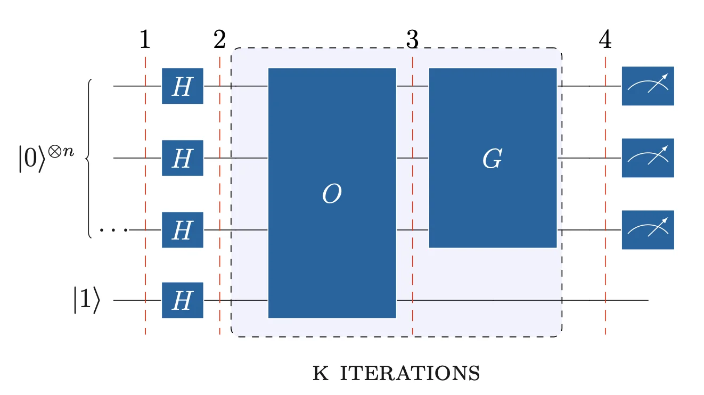
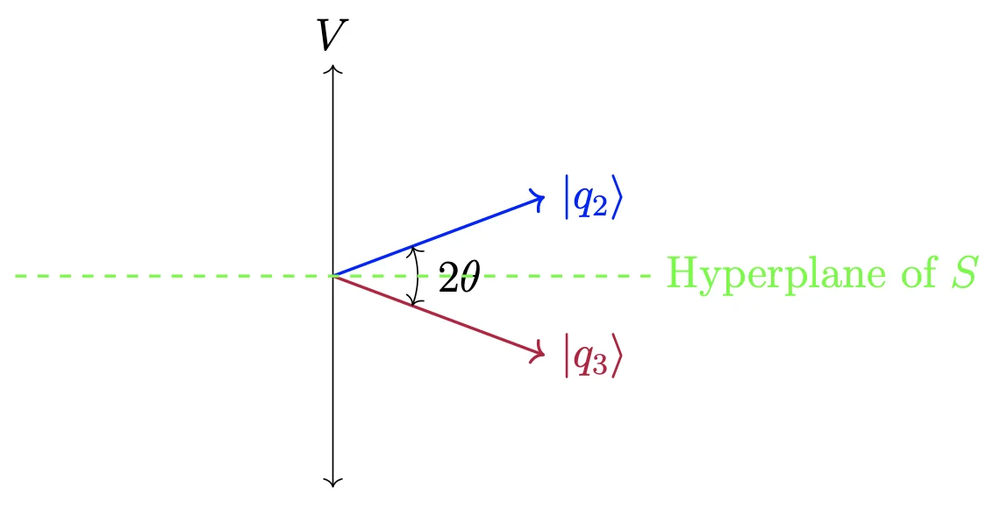
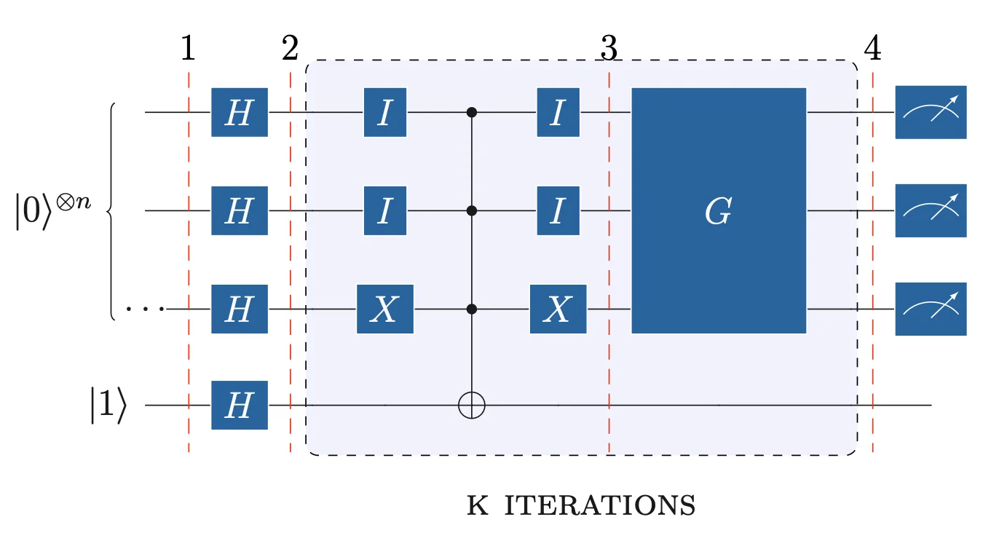
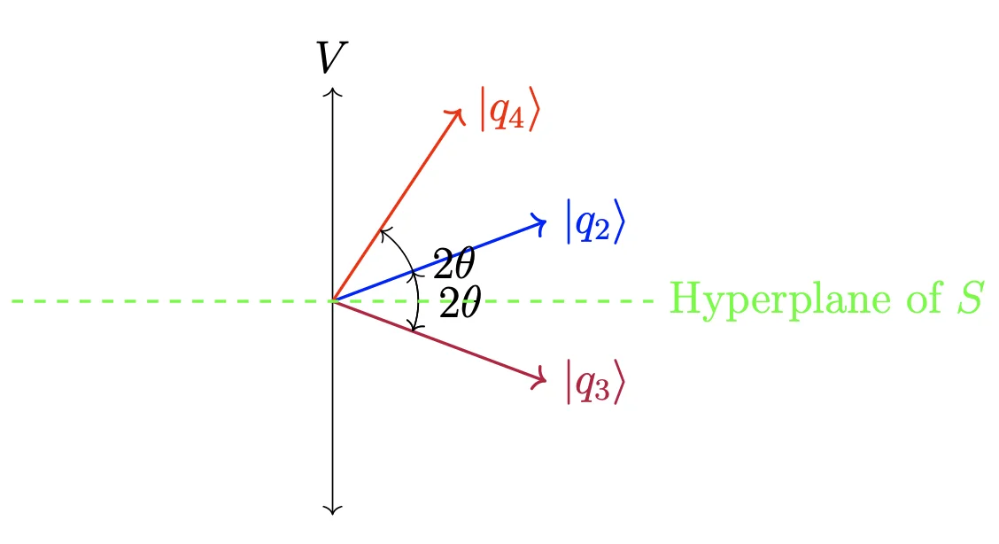
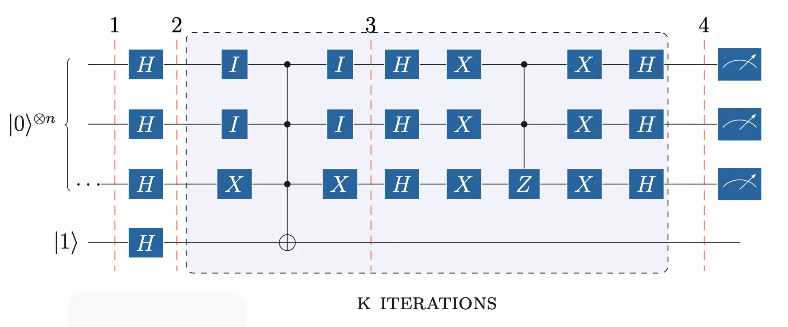
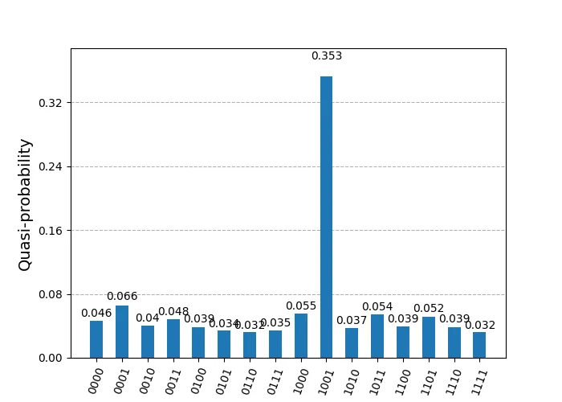
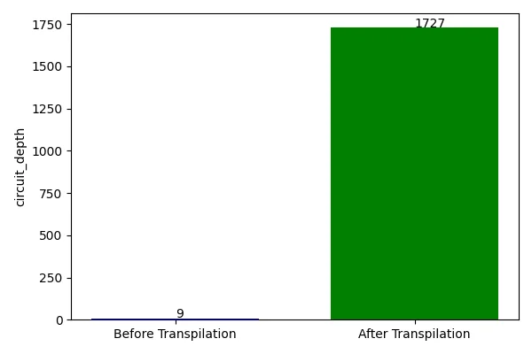
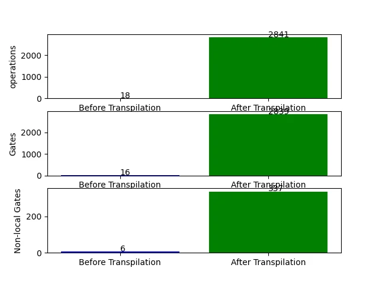
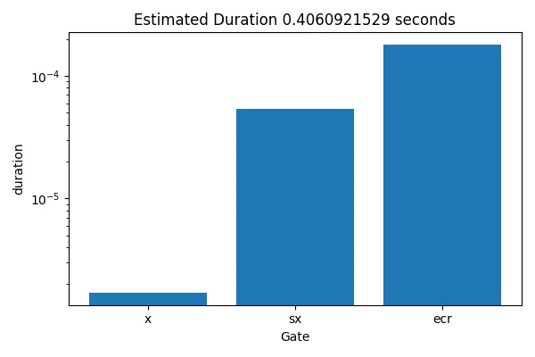

```{python}
#| echo: false
from qiskit import QuantumCircuit, QuantumRegister
from qiskit.circuit import Gate
import matplotlib.pyplot as plt
plt.rcParams['figure.figsize'] = [6, 2]
plt.rcParams['figure.dpi'] = 120
```

# Analysis of Grover's Algorithm

Grover's algorithm provides a polynomial speedup for unstructured database search.

The items of the database are $N = 2^n$, indexed with $i \in \{0,N-1\}$. The equal distributed probability for each query to identify the correct answer is $1/N$. This can be vary depending on the random \"lucky\" sequence, and an average probability of an answered query can be defined as:

$$\sum_{i \in \{0,N-1\}} \frac{1}{N} \times i = \frac{1}{N} \times \frac{(N + 1)N}{2} \approx \frac{N}{2}
$$

The complexity in the classical algorithm is $O(N)$, and Grover improved it to $O(\sqrt{N})$ by using quantum parallelism and interference with n-qubits with equal distributed probability. The oracle implements a function that detects if the item is found during the search. We denote the expected DB Index as $x_i$.

$$f: \{0,1\}^n \rightarrow \{0,1\}$$ $$f(x) = \begin{cases} 
1, & \text{if } x = x_i, \text{found}\\
0, & \text{if } x \neq x_i , \text{not found}\\
\end{cases}
$$


Grover's circuit (@fig-grover-circuit) consists of two operators executed sequentially in $k$ iterations. The first operator is the oracle operator $\hat{O}$, which controls the conditional phase shift with phase kickback, based on $f(x)$ evaluation simultaneously with quantum parallelism. Next, the $G$ operator amplifies the probability amplitude of the founded query encoded in the shifted phase of the respective state, representing the DB index. Therefore, the operator $\hat{O}$ marks the desired index, and $G$ amplifies it to be measured.


::: {layout-nrow=1}
{#fig-grover-circuit fig-alt="Grover’s Algorithm Circuit" width="70%"}
:::

Both are projection operators that shift the register state to the desired vector, resulting in the desired state $|x_i\rangle$.

The linear transformation $P$ for the projection of a vector $\vec{v}$ onto a line, where the line is represented by a vector $\vec{u}$, is:

$$P_u(v) = (uu^T)v
$$

In Hilbert space, the Quantum States are unit vectors of the complex vector space, the Projection operator onto a vector is Hermitian, and projecting a state to another state is an orthonomal projection, shifting the vector to an angle $\theta$:

$$P_u = P_u^2 = u \cdot u^* = |u\rangle\langle u|
$$

The reflection operator extends the projection by reflecting the vector across an axis of reflection represented by another state or a subspace. The vector is shifted by $2\theta$, and the operator is:

$$F_u = 2|u\rangle\langle u|-I_u$$

With these operators, we can project or reflect the register's state onto a vector subspace spanned by one or multiple states. A hyperplane can represent and abstract the vector subspace.

### Phase Shift with Oracle Operator

Prior to the Oracle, all qubits are set in superposition. The oracle qubit $|y\rangle$ is initialized in $|1\rangle$ to achieve the phase kickback:

$$|q_1\rangle = |0\rangle ^{\otimes n} \otimes |1\rangle$$

$$|q_2\rangle = H ^{\otimes n}|x\rangle \otimes |-\rangle$$

Then the oracle acts and the new state is: $$|q_3\rangle =\hat{O} |x\rangle$$

Omitting the Oracle's qubit in $|-\rangle$, the register states will be conditionally phase shifting due to $f(x)$. Therefore, the summation on $|x\rangle ^{\otimes n}$ will contain phases on states depending on: $$phase=
\begin{cases} 
1, & \text{if } f(x) = 0, \text{ (not found)} \\
-1, & \text{if } f(x) = 1, \text{ (found)}, \ x = x_i.
\end{cases}$$

The Oracle operator is defined as: $$\hat{O} = \hat{I} - 2 |x_i\rangle \langle x_i|$$ This operator acts as a negative reflection operator.

$$\hat{O} |x\rangle \rightarrow 
\begin{cases} 
I|x\rangle - 2|x_i\rangle\langle x_i|x\rangle=|x\rangle & \text{if } x \neq x_i, \\
I|x_i \rangle -2|x_i\rangle\langle x_i|x_i\rangle=-|x_i\rangle & \text{if } x = x_i.
\end{cases}
$$

In this step, the Oracle *marks* the searched element based on the query by adding a phase $\pi$. However, the probability remains the same.

The new state can be expressed with $f(x)$, as : $$|q_3\rangle = \frac{1}{\sqrt{2^n}} \sum_{x \in \{0,1\}^n} (-1)^{f(x)} |x\rangle$$

We can decompose the register's state as: 
$$|q_3\rangle = \alpha| \text{FALSE} \rangle + \beta| \text{TRUE} \rangle$$ $$\sum|\psi \rangle \rightarrow
\begin{cases} 
| \text{FALSE} \rangle & \text{if } x \neq x_i, \\
| \text{TRUE} \rangle & \text{if } x = x_i, \\
\end{cases}
$$

The quantum register vector space in $\mathbb{C}^N$ decomposition into two vector subspaces has the following properties. Since all vectors are unit vectors and states, these subspaces will be orthogonal complements of each other.

Let the subspace $V$ spanned by $|x_i\rangle$ with dim(V)=1, and the subspace $S$ spanned by all other states with dimension dim(S)=$N-1$, which is the orthogonal complement of $V$:

$$S \cap V = \{0\}, \quad S \perp V , \quad \mathbb{C}^N = S \oplus V$$

Any state of the register can be expressed as a linear combination of both subspaces with:

$$<x_\perp|x_i>=0,  \quad
<x_\perp|x_i>=1,  \quad
<x_\perp|x_\perp>=1  \quad \Big| \quad x_\perp \in {V}, x_i \in {S}
$$

These subspaces can form a new orthonomal basis set:

$$\begin{aligned}
&|S\rangle = \frac{1}{\sqrt{N-1}} \left( \sum_{x \in \{0,1\}^n \setminus x_i} |x_\perp\rangle \right)& 
&|V\rangle = \frac{1}{\sqrt{N}} |x_i\rangle&\\
\end{aligned}
$$

Rewriting the state needs amplitude normalization. The basis $|V\rangle$ spanned by $|x_i\rangle$, so the amplitude is the same, but the basis $|S\rangle$ spanned by all other states.

$$\begin{aligned}
| \alpha |^2 = 1 - | \beta|^2 = 1 - \Big|-\frac{1}{\sqrt{N}}\Big|^2 = \sqrt{1 - \frac{1}{N}} = \sqrt{\frac{N-1}{N}}
\end{aligned}
$$

Therefore: $$|q_3\rangle = \sqrt{\frac{N-1}{N}} |S\rangle - \frac{1}{\sqrt{N}} |x_i\rangle$$

@fig-hyperplane-01 depicts the state shift after the oracle operator reflection relative to $x_i$. Since there was a negative reflection across the axis of reflection in V, the state reflected across the S vector subspace perpendicular to V. The hyperplane of S, abstracts the one dimension of the ambient space and shifts the perspective to hide all the dimensions of S into a perpendicular line relative to V.

::: {layout-nrow=1}
{#fig-hyperplane-01 fig-alt="Reflection of state" width="70%"}
:::

@fig-oracle-expanded shows the expanded circuit of Oracle. The circuit consists of X and CNOT gates. The first step is the encoding of the search number. To encode it, we apply an I gate for $|1\rangle$ and an X gate for $|0\rangle$ across all qubits, of the control register. The next step is to add a CNOT with all qubits as controls, and the oracle qubit as the target. The third step is to \"close\" the encoding with the gate I for $|1\rangle$ and X for $|0\rangle$. The circuit in figure, encodes $|110\rangle$.


::: {layout-nrow=1}
{#fig-oracle-expanded fig-alt="Oracle Expanded Circuit" width="70%"}
:::

### Amplitude Amplification with Grover Diffusion Operator

The operator $\hat{G}$ amplifies the desired state, which was flipped in phase by the oracle. The amplitude increases by $\frac{2}{\sqrt{N}}$ in each iteration. After $O(\sqrt{N})$ steps, the probability amplitude at the desired state will be near 1.

Hence, the number of required iterations $k$ of $\hat{O}$ and $\hat{G}$ is approximately: $$\frac{\pi}{4} \sqrt{N} - 0.5$$

The Grover operator $\hat{G}$ is given by: $$\hat{G} = 2 | q_2 \rangle \langle q_2 | - \hat{I}$$

The operator $\hat{G}$ reflects the state after $\hat{O}$ action. Thus, it reflects the state $|q_3\rangle$ onto $|q_2\rangle$. This reflection increases the amplitude of the state spanning $V$ and decreases the states spanning $S$.

$$|q_4\rangle = \hat{G} |q_3\rangle =  (2 |q_2\rangle \langle q_2 | - \hat{I}) |q_3\rangle=2|q_2 \rangle \langle q_2|q_3\rangle- |q_3\rangle \tag{1}
$$

The inner product $\langle q_2 | q_3 \rangle$ is: 
$$\begin{aligned}
&\langle q_2 | q_3 \rangle = \left( \frac{1}{\sqrt{N}} \sum_{x \in \{0,1\}^n} \langle x | \right) 
\left( \sqrt{\frac{N-1}{N}} |S \rangle - \frac{1}{\sqrt{N}} |x_i\rangle \right) &\\
&=\left( \frac{1}{\sqrt{N}} \sum_{x \in \{0,1\}^n} \langle x| \sqrt{\frac{N-1}{N}}\frac{1}{\sqrt{N-1}} \sum_{y \in \{0,1\}^n \setminus x_i} |y\rangle \right) -  \frac{1}{\sqrt{N}}\left( \frac{1}{\sqrt{N}} \sum_{x \in \{0,1\}^n} \langle x | x_i \rangle \right) = \frac{N-2}{N}&\\
\end{aligned}
$$

The first part forms an inner product of all states, with the states span ${S}$, $\setminus x_i$. Thus, all N-1 inner products will be 1, and the summation will be N-1 times 1. The second part forms an inner product of all states with the $x_i$ state, which will be 0 for N-1 times and 1 for $x_i$ with itself.

Equation (1) becomes: 
$$\begin{aligned}
&|q_4\rangle = 2|q_2\rangle \left( \frac{N-2}{N}\right)-|q_3\rangle &\\
&=2\left( \frac{N-2}{N}\right)\left(\frac{1}{\sqrt{N}} \sum_{x \in \{0,1\}^n} | x \rangle \right) + \frac{N-2}{\sqrt{N}}|x_i\rangle - \sqrt{\frac{N-1}{N}}|S\rangle &\\
\end{aligned}
$$

Removing $x_i$ from the first summation: 
$$\begin{aligned}
&|q_4\rangle = 2\left( \frac{N-2}{N}\right)\left(\frac{1}{\sqrt{N}} \sum_{x \in \{0,1\}^n \setminus x_i} | x \rangle + \frac{1}{\sqrt{N}}|x_i\rangle \right) + \frac{N-2}{\sqrt{N}}|x_i\rangle - \sqrt{\frac{N-1}{N}}|S\rangle &\\
\end{aligned}
$$

Replacing $|S\rangle$: 
$$\begin{aligned}
&|q_4\rangle = 2\left( \frac{N-2}{N}\right)\left(\frac{1}{\sqrt{N}} \sum_{x \in \{0,1\}^n \setminus x_i} | x \rangle + \frac{1}{\sqrt{N}}|x_i\rangle \right) + \frac{N-2}{\sqrt{N}}|x_i\rangle - \sqrt{\frac{N-1}{N}}\frac{1}{\sqrt{N-1}}\sum_{x \in \{0,1\}^n \setminus x_i} | x \rangle &\\
\end{aligned}
$$

Factoring out the common parts: 
$$\begin{aligned}
&|q_4\rangle = \frac{3N-4}{N\sqrt{N}} | x_i\rangle + \frac{N-4}{N\sqrt{N}} \sum_{x \in \{0,1\}^n \setminus x_i} | x \rangle &\\
\end{aligned}
$$

For a quick verification, if N=4: $$\begin{aligned}
&|q_4\rangle = 1| x_i\rangle + 0\sum_{x \in \{0,1\}^n \setminus x_i} | x \rangle &\\
\end{aligned}$$ We can observe that the probability amplitude of $x_i$ is more significant than every state in $S$. Thus, the $\hat{G}$, amplified it. @fig-reflection-state shows the new reflection of state $|q_4\rangle$.


::: {layout-nrow=1}
{#fig-reflection-state fig-alt="Reflection of state" width="70%"}
:::

The amplitude amplification circuit consists of H, X, and CZ gates. The first step applies a set of H and X gates to all control qubits except the oracle qubit. The second step applies a CZ gate with control on all $n-1$ qubits, and targets the $n$-th qubit, not the oracle qubit. The last step applies a set of H and X gates again to all controll $n$ qubits. As in the Deutsch algorithm, we measure all $n$ qubits in the control or upper register.


::: {layout-nrow=1}
{#fig-expanded-full width="100%"}
:::


## Qiskit Simulation of Grover Algorithm

```{python}
#| echo: false
from qiskit import QuantumCircuit, QuantumRegister, ClassicalRegister
from qiskit.providers import BackendV2
from qiskit.visualization import plot_distribution
from qiskit.transpiler.preset_passmanagers import generate_preset_pass_manager
from qiskit_aer import AerSimulator
from qiskit_ibm_runtime import SamplerV2 as Sampler, RuntimeJobV2
from qiskit.circuit.library import ZGate
import matplotlib.pyplot as plt
plt.rcParams['figure.figsize'] = [6, 3]
plt.rcParams['figure.dpi'] = 120
```

The circuit implements Grover's algorithm with $n=4$ qubits, searching for the target state $|1001\rangle$. The number of iterations is $k = \text{round}\!\left(\frac{\pi}{4}\sqrt{2^4} - 0.5\right) = 3$. The Oracle and Grover diffusion operator are built as sub-circuits and appended $k$ times.

Circuit Construction, with 4-qubits Control Register, and 1-qubit Target Register.

```{python}
#| echo: true
#| layout-nrow: 1
import math
from qiskit import QuantumCircuit, QuantumRegister, ClassicalRegister
from qiskit.circuit.library import ZGate

qr1 = QuantumRegister(4, 'control')
cr1 = ClassicalRegister(4, 'measurement')
qr2 = QuantumRegister(1, 'target')
qc = QuantumCircuit(qr1, qr2, cr1)
```

Calculate the needed iterations over O and G operators.
```{python}
k = round((math.pi / 4) * math.sqrt(2 ** len(qr1)) - 0.5)
```

Initialise circuit with fliping target register to 1, and apply H gates to registers:

```{python}
# Initialise: flip target to |1⟩, apply H to all
qc.x(qr2)
qc.barrier(label='1')
qc.h(qr1)
qc.h(qr2)
qc.barrier(label='2')
```

Build the Oracle Operator, applying I for $|1⟩$ and X for $|0⟩$.
qiskit tensors qubits in reverse.
Encode $|x_i⟩=|1001⟩$ respectively:

```{python}
# Oracle for |1001⟩: I for |1⟩ bits, X for |0⟩ bits, MCX, undo
oracle = QuantumCircuit(qr1, qr2)
oracle.id(qr1[3])
oracle.x(qr1[2])
oracle.x(qr1[1])
oracle.id(qr1[0])

# Apply the multi-control-NOT Gate, with reg2 as target
oracle.mcx(qr1, qr2)

# Apply I for |1⟩ and X for |0⟩, again
oracle.id(qr1[3])
oracle.x(qr1[2])
oracle.x(qr1[1])
oracle.id(qr1[0])
```

Build Grover Diffusion Operator:

```{python}
# Grover diffusion: H·X·(multi-controlled Z)·X·H
grover = QuantumCircuit(qr1, qr2)
grover.h(qr1)
grover.x(qr1)

# Construct a multi-control-Z Gate, with 3 ctrl qubits
mcz = ZGate().control(num_ctrl_qubits=3, ctrl_state='111', annotated=True)

# Append the gate using the reversed qubits,due to qiskit qubit ordering
# the target should be the first control qubit
grover.append(mcz, qr1[::-1])
grover.x(qr1)
grover.h(qr1)
```

Construct Circuit operators for k iterations, then measure control register:

```{python}
#| echo: true
#| layout-nrow: 1
# Append Oracle + Grover k times
for i in range(k):
    qc.append(oracle.to_instruction(label=f"oracle_{i+1}"), qr1[:] + qr2[:])
    qc.append(grover.to_instruction(label=f"grover_{i+1}"), qr1[:] + qr2[:])

qc.measure(qr1, cr1)
qc.draw(output='mpl', style='iqp')
```


```{python}
#| echo: true
#| layout-nrow: 1
qc.decompose().draw(output="mpl", style="iqp")
```


The probability for |1001⟩ state is almost 1, thus we found the marked index:

```{python}
#| layout-nrow: 1
from qiskit_aer import AerSimulator
from qiskit.transpiler.preset_passmanagers import generate_preset_pass_manager
from qiskit_ibm_runtime import SamplerV2 as Sampler
from qiskit.visualization import plot_distribution

backend = AerSimulator()
pass_manager = generate_preset_pass_manager(optimization_level=0, backend=backend)
transpiled_circuit = pass_manager.run(qc)

sampler = Sampler(mode=backend)
sampler.options.default_shots = 1024
result = sampler.run([transpiled_circuit]).result()
counts = result[0].data.measurement.get_counts()
plot_distribution(counts)
```

# Executing on real Quantum Computer {#executing-on-real-quantum-computer .unnumbered}

During experiments, I faced a few issues executing the circuit on Fake and Real Backends. The code executed on **ibm_kyoto**, due to immediate availability, and simulated on **fake_kyoto** backend. The real_kyoto and fake_kyoto results were always noisy, and the final measurement had no clear probability of the expected outcome, as found in the ideal simulation. Questioning about my circuit optimization for the real backends, I experimented with the [official Grover operator package from qiskit](https://learning.quantum.ibm.com/tutorial/grovers-algorithm), and executed it in various fake backends. Indeed, Kyoto was unreliable again, even for this circuit, leading me to change the backend. FakeSherbrooke and FakeBrisbane were reliable, and I could verify the presented result from qiskit tutorial about Grover. Furthermore, I executed my circuit in these backends and got less noisy and more reliable results, so I could consider my circuit to be okay.


Analyzing further and using only FakeSherbrooke, before executing on real ibm_sherbrooke, I've noticed that using the **`scheduling_method='alap'`** or **`scheduling_method='asap'`**, during transpilation, I could slightly observe the expected result, but with more noisy and less reliable results, leading me to a question on when and how to use these options. However, these transpilation options affect the reliability of the final result, and I left them empty. I noticed a more reliable result, with accepted noise.

```{python}
#| echo: false
#| eval: false
from qiskit import transpile
from qiskit.quantum_info import Statevector
from qiskit.visualization import (
    plot_histogram, plot_bloch_multivector,
    plot_state_qsphere, plot_distribution,
)
from qiskit_aer import AerSimulator
from qiskit_ibm_runtime import QiskitRuntimeService, SamplerV2 as Sampler
from qiskit_ibm_runtime.fake_provider import FakeSherbrooke
```

```{python}
#| echo: true
#| eval: false
#| code-fold: true
#| code-summary: "Helper — `job_metrics()`"
def job_metrics(job, backend):
    """Print job ID, counts histogram, and distribution for a completed job."""
    experiment = backend.name
    pub_result = job.result()
    print(f"Job ID: {job.job_id()}")

    if experiment == "aer_simulator_statevector":
        counts = pub_result.get_counts()
        plot_histogram(counts)
        plt.show()
        for key, value in pub_result.data(0).items():
            if isinstance(value, Statevector):
                statevector = value
                print(f"\nStatevector — {key}:")
                for state, prob in statevector.probabilities_dict().items():
                    print(f"  |{state}⟩: {prob:.4f}")
                plot_bloch_multivector(statevector)
                plt.show()
                plot_state_qsphere(statevector, show_state_phases=True)
                plt.show()
    else:
        data_bin = pub_result[0].data
        for key in data_bin.keys():
            counts = data_bin[key].get_counts()
            plot_histogram(counts, title=key)
            plt.show()
            plot_distribution(counts, title=key)
            plt.show()
```

```{python}
#| echo: true
#| eval: false
#| code-fold: true
#| code-summary: "Helper — `circuit_metrics()`"
def circuit_metrics(circuit, transpiled_circuit, backend):
    """Draw circuit diagrams, depth, gate counts, and gate duration."""
    labels = ['Before', 'After']
    experiment = backend.name

    circuit.draw(output='mpl')
    plt.show()
    transpiled_circuit.draw(output='mpl', idle_wires=False, style="iqp")
    plt.show()

    # Depth
    depths = [circuit.depth(), transpiled_circuit.depth()]
    plt.figure(figsize=(6, 4))
    plt.bar(labels, depths, width=0.7, color=['blue', 'green'])
    plt.ylabel('circuit depth')
    for i, d in enumerate(depths):
        plt.text(x=i, y=d + 1, s=f"{d}")
    plt.tight_layout()
    plt.show()

    # Operations, gates, non-local gates
    operations = [sum(circuit.count_ops().values()),       sum(transpiled_circuit.count_ops().values())]
    gates      = [circuit.size(),                          transpiled_circuit.size()]
    nonlocal   = [circuit.num_nonlocal_gates(),            transpiled_circuit.num_nonlocal_gates()]

    fig, (ax1, ax2, ax3) = plt.subplots(3, 1)
    for ax, data, label in zip(
        (ax1, ax2, ax3),
        (operations, gates, nonlocal),
        ('operations', 'gates', 'non-local gates'),
    ):
        ax.bar(labels, data, color=['blue', 'green'])
        ax.set_ylabel(label)
        for i, d in enumerate(data):
            ax.text(x=i, y=d + 1, s=f"{d}")
    plt.tight_layout()
    plt.show()

    # Gate duration — real / fake backends only
    if experiment not in ("aer_simulator", "aer_simulator_statevector"):
        gate_lengths = {}
        props = backend.properties()
        for instr in transpiled_circuit.data:
            qubits    = [q._index for q in instr.qubits]
            gate_name = instr.operation.name
            if gate_name in ('barrier', 'measure', 'delay'):
                continue
            dur = props.gate_length(gate_name, qubits)
            if dur:
                gate_lengths[gate_name] = gate_lengths.get(gate_name, 0) + dur
        total     = sum(gate_lengths.values())
        estimated = transpiled_circuit.depth() * total
        plt.figure(figsize=(6, 4))
        plt.bar(gate_lengths.keys(), gate_lengths.values())
        plt.xlabel('Gate')
        plt.ylabel('duration (s)')
        plt.yscale('log')
        plt.title(f"Estimated duration: {estimated:.10f} s")
        plt.tight_layout()
        plt.show()
```

```{python}
#| echo: true
#| eval: false
#| code-fold: true
#| code-summary: "Helper — `aer_mimic_simulation()`"
def aer_mimic_simulation(circuit, backend, shots, metrics=False, run=False):
    """Transpile and optionally run a circuit on an Aer (or fake) backend."""
    experiment = backend.name
    use_primitives = True
    print(experiment)

    if experiment == "aer_simulator_statevector":
        transpiled_circuit = transpile(circuit, backend)
        use_primitives = False
    elif experiment == "aer_simulator":
        pm = generate_preset_pass_manager(optimization_level=0, backend=backend)
        transpiled_circuit = pm.run(circuit)
    else:
        pm = generate_preset_pass_manager(
            optimization_level=3,
            backend=backend,
            timing_constraints=backend.target.timing_constraints(),
        )
        transpiled_circuit = pm.run(circuit)

    if metrics:
        circuit_metrics(circuit, transpiled_circuit, backend)
    if run:
        if use_primitives:
            sampler = Sampler(mode=backend)
            sampler.options.default_shots = shots
            job = sampler.run([transpiled_circuit])
        else:
            job = backend.run(transpiled_circuit, shots=shots)
        job_metrics(job=job, backend=backend)
```

```{python}
#| echo: true
#| eval: false
# Simulate on FakeSherbrooke (noise model derived from real hardware)
backend = AerSimulator.from_backend(FakeSherbrooke())
aer_mimic_simulation(circuit=qc, backend=backend, shots=4096, metrics=True, run=True)
```

::: {layout-ncol=2}


:::

Extending the debugging further, I compared my circuit on the same backend with the Grover Operator-ready circuit from the qiskit tutorial, searching for the number 1001, and I noticed better clarity on the tutorial circuit. I assume that the gates would be efficiently reduced and optimized.

::: {layout-ncol=2}



:::

Since the result from my circuit was acceptable from FakeSherbrooke backend, I executed the circuit on real `ibm_sherbrooke`. The following graphs show the circuit and job metrics.

```{python}
#| echo: true
#| eval: false
service = QiskitRuntimeService(
    channel='ibm_quantum',
    instance='ibm-q/open/main',
    token='YOUR_IBM_QUANTUM_TOKEN',
)
backend = service.backend('ibm_sherbrooke')

print(
    f"Backend: {backend.name}\n"
    f"Version: {backend.version}\n"
    f"No. of qubits: {backend.num_qubits}\n"
    f"Backend dt: {backend.dt:.10f} s\n"
)

pm = generate_preset_pass_manager(
    optimization_level=3,
    backend=backend,
    timing_constraints=backend.target.timing_constraints(),
)
transpiled_circuit = pm.run(qc)
circuit_metrics(qc, transpiled_circuit, backend)

sampler = Sampler(mode=backend)
sampler.options.default_shots = 4096
job = sampler.run([transpiled_circuit])
job_metrics(job=job, backend=backend)
```

::: {layout-ncol=2}



:::


