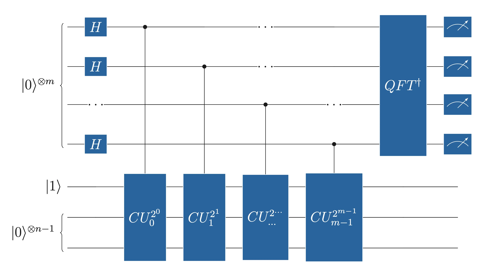
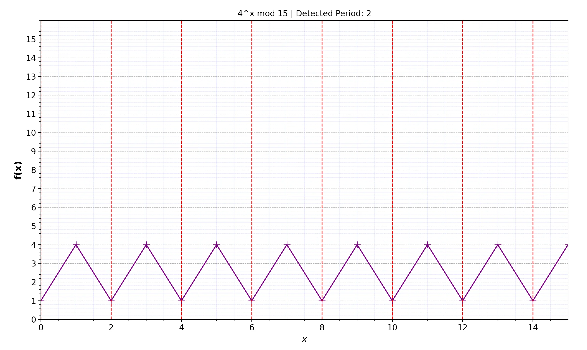
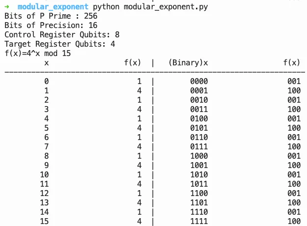
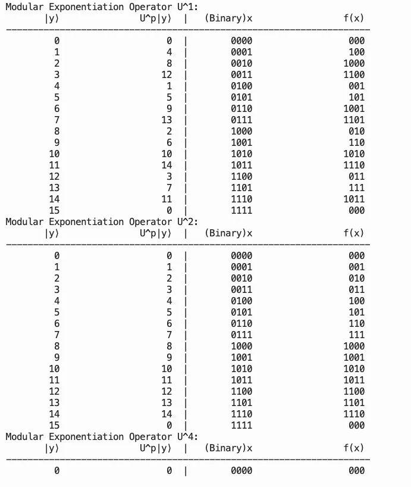
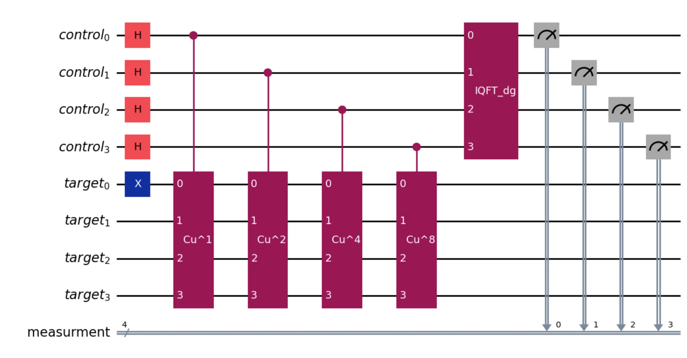
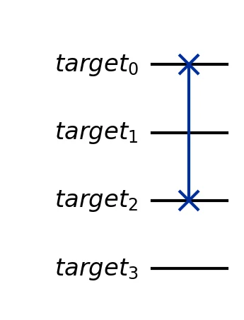
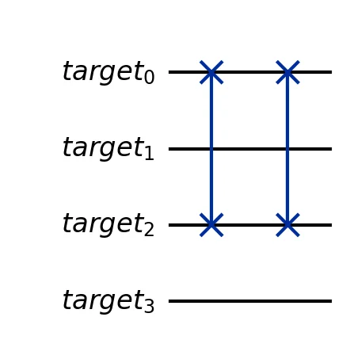
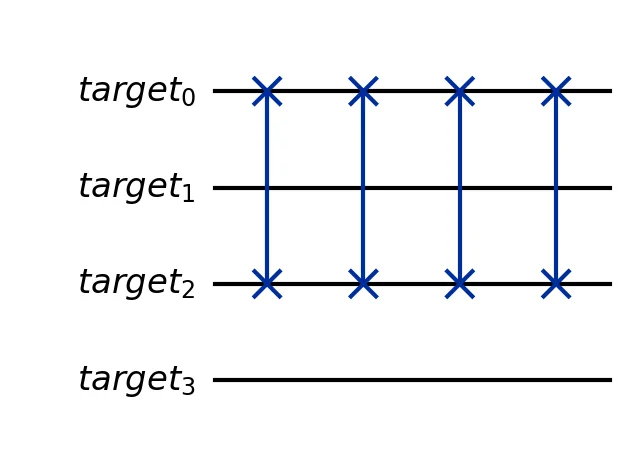
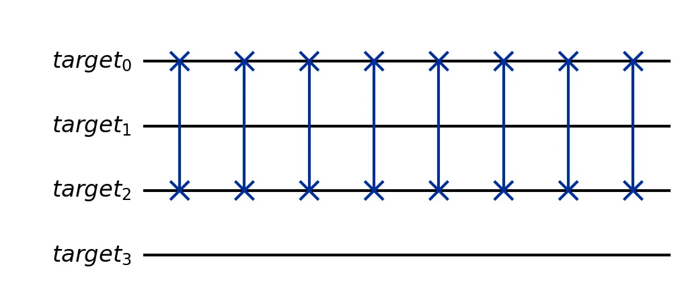
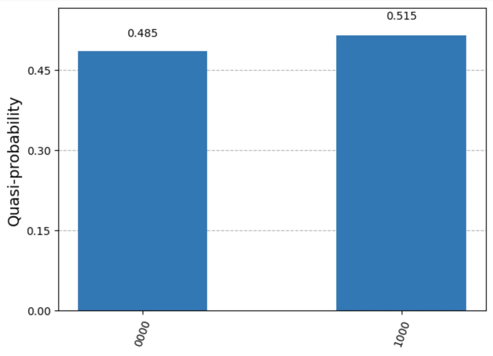

```{python}
#| echo: false
import matplotlib.pyplot as plt
plt.rcParams['figure.figsize'] = [6, 3]
plt.rcParams['figure.dpi'] = 120
```

# General Analysis of Shor's Algorithm

Shor's algorithm provides a methodology to factor a prime integer in polynomial time. Factoring in classical computers is a Non-Polynomial Problem but has not yet been classified as NP-complete. Shor's algorithm consists of classical and quantum computation steps composed of number theory and quantum phase estimation techniques. Its best-known application is breaking the RSA Cryptosystem, but with a qubit number barrier. As it has been proved, the algorithm needs at least twice the number of qubits required to encode the random big integer prime of the system. This means that for an RSA2048-produced integer prime with 2048 bits, the algorithm needs at least 4096 qubits.

The lower computational cost of breaking the RSA system is to find the period of a modular exponent function and apply it to $gcd$ functions to construct the two factors of the prime integer. These two factors lead to retrieving the private key.


### RSA Components in a nutshell

-   $p, q$: Two large prime numbers.

-   $N = p \times q$: The modulus used in both the public and private keys.

-   $d$: Private exponent, random integer prime to $(p - 1) \times (q - 1)$

-   $e$: Public exponent given by: $$d \times e \equiv 1 \ (\text{mod} \ (p - 1) \times (q - 1))$$

-   Public key: $(e, N)$

-   Private key: $(d, N)$

-   Encryption: Given message $M$, $C = M^e \mod N$

-   Decryption: Given ciphertext $C$, $M = C^d \mod N$

Shor's Algorithm has only one quantum computational part, which is to find the period using the Quantum Phase Estimation by applying the modular exponent function as an Oracle.

### Modular exponent function

$f(x) = a^x \mod N$, with a random chosen number where $2 < a < N$ and $\gcd(a, N) = 1$

$x \in \mathbb{N}_0 = \{0, 1, 2, 3, \dots\}$

### Period finding

For each $x$ (in decimal), the function $f$ is being evaluated until $f(x)=1$, then the non-zero iteration $x$, is the period. The period of $f$, denoted with $r$, and it is the first non-zero integer that: $$f(r) = a^r \mod N = 1 \tag{1}$$

### Quantum Phase Estimation (QPE)

QPE (@fig-qpe-circuit) extends the Phase-kickback phenomenon and provides an algorithm to calculate a Unitary Operator in high accuracy. It consists of two registers, usually with different names, but we'll keep *control* and *target* for simplicity. If the Control Register has $m$-qubits and the target register has $n$-qubits, the Unitary Operator (U) is a controlled-Unitary operator (CU) controlled by control qubits and acting on all target register qubits. The appliance needs a convention on how the quantum register represents the bits. Qiskit ecosystem has an inverted convention, which we will use here for simplicity. Thus, the most significant bit (MSB) is represented by the least significant register number e.g. for a 5-bit number, $x_4$ is represented by qubit $q_0$, and $x_0$ by qubit $q_4$.

::: {layout-nrow=1}
{#fig-qpe-circuit fig-alt="QPE Circuit" width="100%"}
:::

If $x_{[10]}$ is a x in decimal state and $x_{[2]}$ the binary, represented by control register with m-bits, then:

$x_{[10]}= 2^{m-1}x_{m-1}+2^{m-2}x_{m-2}...+ 2^{0}x_{0}$

The binary expansion of $m$, relative to the control register state, is:
$$x_{[2]} = x_{m-1}x_{m-2}...x_{0}$$

The unitary operator is creating an eigenvector of the applied state vector:

$$U|\psi\rangle = e^{2\pi i \theta}|\psi\rangle$$

The phase $\theta$ controls the eigenvalue and has a value of 0 to 1 range.

The unitary operator U application is proportional to the number of control register qubits, and the target is all target register qubits.

For each $j \in \{0..m-1\}$:

$$CU^{2^j}_j$$

For 1 control qubit $m=1$, the control version of U:

$$\begin{aligned}
&CU^{2^0}_0|+\rangle|\psi\rangle = \frac{1}{\sqrt{2^m}}CU^{2^0}_0 \left(|0\rangle|\psi\rangle + |1\rangle|\psi\rangle\right) = \frac{1}{\sqrt{2}} \left(CU^{2^0}_0|0\rangle|\psi\rangle + CU^{2^0}_0|1\rangle|\psi\rangle\right)&\\
&=\frac{1}{\sqrt{2}} \left(|0\rangle|\psi\rangle + |1\rangle U^{2^0}_0|\psi\rangle\right)=\frac{1}{\sqrt{2}} \left(|0\rangle|\psi\rangle + |1\rangle e^{2\pi i \theta 2^0}|\psi\rangle\right) &\\
&=\frac{1}{\sqrt{2}} \left[(|0\rangle + e^{2\pi i \theta 2^0}|1\rangle) |\psi\rangle\right]
\end{aligned}$$

This is the phase kickback since the global phase of the target qubit, controlled by the U operator, is transferred back to the relative phase of the control qubit.

Generalizing the equation to m-bits summation, the control register's state after CU applications will be:

$$|\psi_1\rangle= H^{\otimes m}|0\rangle \otimes |1\rangle|0\rangle^{\otimes{n-1}}$$

$$|\psi_2\rangle=\frac{1}{\sqrt{2^m}}\sum_{k \in \{0,2^m-1\}} e^{2\pi i \theta k} |k\rangle$$

Applying the inversed QFT $(QFT^\dagger)$, will convert the phase into control register's state, and we can measure it:
$$|\psi_3\rangle=QFT^\dagger|\psi_2\rangle= |2^m \theta\rangle \tag{2}$$

## Simulate Shor's Algorithm in Qiskit

Shor circuit uses the QPE circuit (@fig-qpe-circuit) for period finding upon control register measurement. After the measurement, post-processing is performed to factor the given prime integer using the founded period. To describe the algorithm, we will use $N=15$, as the prime integer we need to factor. The most critical part is to create the Oracle Circuit, which I found confusing when I tried to apply the QPE-separated CU oracles. I made a tool to perform a few calculations before oracle design, in order to select the number $a$ for the modular exponent function. Since this number dictates the period, it has direct impact on circuit complexity. I found it easier to work with $a=4$ due to function outputs, which made it easier to construct the circuit. This tool is nothing special, and many qiskit examples having similar tools.

The modular exponent table below shows $f(x) = 4^x \mod 15$:

```{python}
#| echo: true
N, a = 15, 4
print(f"f(x) = {a}^x mod {N}\n")
print(f"{'x':>4} | {'f(x)':>6}")
print("-" * 14)
for x in range(2 * N):
    fx = pow(a, x, N)
    print(f"{x:>4} | {fx:>6}")
    if x > 0 and fx == 1:
        print(f"\nPeriod r = {x}")
        break
```

::: {layout-nrow=1}
{#fig-mod-exp fig-alt="Modular exponent table" width="100%"}
:::

::: {layout-nrow=1}
{#fig-period fig-alt="Period detection" width="70%"}
:::

Along with the period, we calculate the needed qubits for Control register ($m$) and for target ($n$) with: $$n=\log_2 N, \quad m = 2n$$

To construct the multiple Controlled Oracles, we need to construct the first instance with $j=0$, and detect the output. In Shor's Algorithm, the U operator is:

$$U_{a,N}|y\rangle=|a y \mod N \rangle$$

In our case, $N=15$ and we chose $a=4$: $$U_{4,15}|y\rangle=|4 y \mod 15 \rangle$$

We will choose fewer qubits for this example. We have $m=n=4$, U is unitary, and QPE starts the target register in $|1\rangle$, therefore:
$$U_{4,15}^{2^0}|y\rangle=U_{4,15}|y\rangle=|4 y \mod 15 \rangle$$
$$U_{4,15}^{2^1}|y\rangle=U_{4,15}^{2}|y\rangle=|4^2 y \mod 15 \rangle$$
$$U_{4,15}^{2^2}|y\rangle=U_{4,15}^{4}|y\rangle=|4^4 y \mod 15 \rangle$$
$$U_{4,15}^{2^3}|y\rangle=U_{4,15}^{8}|y\rangle=|4^8 y \mod 15 \rangle$$

As shown in the period table above, the first non-zero $x$ with $f=1$ is 2, therefore $r=2$. $$f(1)=4 \qquad f(2)=1$$

Applying the Oracles, we can observe the state changes needed to construct the circuit:
$$U_{4,15}|1\rangle=|4\rangle$$
$$U_{4,15}^{2}|1\rangle=U_{4,15}(U_{4,15}|1\rangle)=U_{4,15}|4\rangle=|1\rangle$$
$$U_{4,15}^{4}|1\rangle=U_{4,15}^{2}(U_{4,15}^{2}|1\rangle)=U_{4,15}^{2}|1\rangle=|1\rangle$$
$$U_{4,15}^{8}|1\rangle=U_{4,15}^{4}(U_{4,15}^{4}|1\rangle)=|1\rangle$$

Only the first Oracle application is transforming the following states:

$$U_{4,15}: |1\rangle \xrightarrow[]{} |4\rangle \qquad U_{4,15}: |4\rangle \xrightarrow[]{} |1\rangle$$

The other Oracle appliances do not change state. Hence, the decision of $a=4$, consulting the oracle overview below:

::: {layout-nrow=1}
{#fig-oracles fig-alt="Oracle overview" width="70%"}
:::

The circuit was simulated with Qiskit and executed using the ideal simulator. The circuit diagram (@fig-shor-circuit) shows the full Shor circuit, and the four Oracle appliances are shown in @fig-cu-oracles. The SWAP of target_0 and target_2 qubits of the target register covers the state transitions, and for all other applications, the multiplied execution of SWAP reverts the state to the beginning.

Since $U = \text{SWAP}(\text{target}_0, \text{target}_2)$ and $U^2 = I$ (SWAP is self-inverse), only $CU^1$ requires a gate — a single CSWAP controlled by the first control qubit. The circuit is built below:

```{python}
#| echo: true
#| layout-nrow: 1
import math
from qiskit import QuantumCircuit, QuantumRegister, ClassicalRegister
from qiskit.circuit.library import QFT

N = 15
a = 4
n = int(math.ceil(math.log2(N)))   # 4 target qubits
m = n                               # 4 control qubits (m=n as in the article)

qr_ctrl = QuantumRegister(m, 'control')
qr_tgt  = QuantumRegister(n, 'target')
cr      = ClassicalRegister(m, 'measure')
qc = QuantumCircuit(qr_ctrl, qr_tgt, cr)

# Initialise target in |1⟩
qc.x(qr_tgt[0])
qc.barrier()

# Superposition of control register
qc.h(qr_ctrl)
qc.barrier()

# Controlled-U^{2^j} oracles
# U_{4,15}: |1⟩ ↔ |4⟩  →  SWAP(target[0], target[2])
# U^2 = U^4 = U^8 = I  (SWAP² = I, no additional gates needed)
qc.cswap(qr_ctrl[0], qr_tgt[0], qr_tgt[2])
qc.barrier()

# Inverse QFT on control register
iqft = QFT(m, inverse=True)
qc.append(iqft, qr_ctrl)
qc.barrier()

# Measure control register
qc.measure(qr_ctrl, cr)
qc.draw(output='mpl', style='iqp')
```

::: {layout-nrow=1}
{#fig-shor-circuit fig-alt="Shor Circuit in Qiskit" width="100%"}
:::

::: {layout-ncol=2}
{#fig-cu-oracles fig-alt="Oracle CU^1"}

{fig-alt="Oracle CU^2"}

{fig-alt="Oracle CU^4"}

{fig-alt="Oracle CU^8"}
:::

The probability for $|0000\rangle$ and $|1000\rangle$ states is approximately equal, encoding the two phase values $\phi = 0$ and $\phi = 1/2$:

```{python}
#| echo: true
from qiskit_aer import AerSimulator
from qiskit.transpiler.preset_passmanagers import generate_preset_pass_manager
from qiskit_ibm_runtime import SamplerV2 as Sampler
from qiskit.visualization import plot_distribution

backend = AerSimulator()
pm = generate_preset_pass_manager(optimization_level=0, backend=backend)
transpiled = pm.run(qc)

sampler = Sampler(mode=backend)
sampler.options.default_shots = 1024
result = sampler.run([transpiled]).result()
counts = result[0].data.measure.get_counts()
plot_distribution(counts)
```

::: {layout-nrow=1}
{#fig-shor-dist fig-alt="Ideal Simulator Results" width="60%"}
:::

# Executing on Real Quantum Computer {#executing-on-real-quantum-computer .unnumbered}

The code was executed on `ibm_brisbane` due to immediate availability, but the results were wrong (@fig-backend-counts, left). `FakeSherbrooke` was more reliable during experiments (@fig-backend-counts, right), and I executed my circuit on a `ibm_sherbrooke` backend, but with noticeable noise. During all Assignments, I've noticed that Brisbane is not responding reliably in more complex circuits, while Sherbrooke provides less noisy results. Exporting Operations metrics (@fig-operations), I can observe that Brisbane has fewer operations after transpilation, which may explain the more noisy results.

```{python}
#| echo: false
#| eval: false
from qiskit import transpile
from qiskit.quantum_info import Statevector
from qiskit.visualization import (
    plot_histogram, plot_bloch_multivector,
    plot_state_qsphere, plot_distribution,
)
from qiskit_aer import AerSimulator
from qiskit_ibm_runtime import QiskitRuntimeService, SamplerV2 as Sampler
from qiskit_ibm_runtime.fake_provider import FakeSherbrooke
```

```{python}
#| echo: true
#| eval: false
#| code-fold: true
#| code-summary: "Helper — `job_metrics()`"
def job_metrics(job, backend):
    """Print job ID, counts histogram, and distribution for a completed job."""
    experiment = backend.name
    pub_result = job.result()
    print(f"Job ID: {job.job_id()}")

    if experiment == "aer_simulator_statevector":
        counts = pub_result.get_counts()
        plot_histogram(counts)
        plt.show()
        for key, value in pub_result.data(0).items():
            if isinstance(value, Statevector):
                statevector = value
                print(f"\nStatevector — {key}:")
                for state, prob in statevector.probabilities_dict().items():
                    print(f"  |{state}⟩: {prob:.4f}")
                plot_bloch_multivector(statevector)
                plt.show()
                plot_state_qsphere(statevector, show_state_phases=True)
                plt.show()
    else:
        data_bin = pub_result[0].data
        for key in data_bin.keys():
            counts = data_bin[key].get_counts()
            plot_histogram(counts, title=key)
            plt.show()
            plot_distribution(counts, title=key)
            plt.show()
```

```{python}
#| echo: true
#| eval: false
#| code-fold: true
#| code-summary: "Helper — `circuit_metrics()`"
def circuit_metrics(circuit, transpiled_circuit, backend):
    """Draw circuit diagrams, depth, gate counts, and gate duration."""
    labels = ['Before', 'After']
    experiment = backend.name

    circuit.draw(output='mpl')
    plt.show()
    transpiled_circuit.draw(output='mpl', idle_wires=False, style="iqp")
    plt.show()

    # Depth
    depths = [circuit.depth(), transpiled_circuit.depth()]
    plt.figure(figsize=(6, 4))
    plt.bar(labels, depths, width=0.7, color=['blue', 'green'])
    plt.ylabel('circuit depth')
    for i, d in enumerate(depths):
        plt.text(x=i, y=d + 1, s=f"{d}")
    plt.tight_layout()
    plt.show()

    # Operations, gates, non-local gates
    operations = [sum(circuit.count_ops().values()),       sum(transpiled_circuit.count_ops().values())]
    gates      = [circuit.size(),                          transpiled_circuit.size()]
    nonlocal   = [circuit.num_nonlocal_gates(),            transpiled_circuit.num_nonlocal_gates()]

    fig, (ax1, ax2, ax3) = plt.subplots(3, 1)
    for ax, data, label in zip(
        (ax1, ax2, ax3),
        (operations, gates, nonlocal),
        ('operations', 'gates', 'non-local gates'),
    ):
        ax.bar(labels, data, color=['blue', 'green'])
        ax.set_ylabel(label)
        for i, d in enumerate(data):
            ax.text(x=i, y=d + 1, s=f"{d}")
    plt.tight_layout()
    plt.show()

    # Gate duration — real / fake backends only
    if experiment not in ("aer_simulator", "aer_simulator_statevector"):
        gate_lengths = {}
        props = backend.properties()
        for instr in transpiled_circuit.data:
            qubits    = [q._index for q in instr.qubits]
            gate_name = instr.operation.name
            if gate_name in ('barrier', 'measure', 'delay'):
                continue
            dur = props.gate_length(gate_name, qubits)
            if dur:
                gate_lengths[gate_name] = gate_lengths.get(gate_name, 0) + dur
        total     = sum(gate_lengths.values())
        estimated = transpiled_circuit.depth() * total
        plt.figure(figsize=(6, 4))
        plt.bar(gate_lengths.keys(), gate_lengths.values())
        plt.xlabel('Gate')
        plt.ylabel('duration (s)')
        plt.yscale('log')
        plt.title(f"Estimated duration: {estimated:.10f} s")
        plt.tight_layout()
        plt.show()
```

```{python}
#| echo: true
#| eval: false
#| code-fold: true
#| code-summary: "Helper — `aer_mimic_simulation()`"
def aer_mimic_simulation(circuit, backend, shots, metrics=False, run=False):
    """Transpile and optionally run a circuit on an Aer (or fake) backend."""
    experiment = backend.name
    use_primitives = True
    print(experiment)

    if experiment == "aer_simulator_statevector":
        transpiled_circuit = transpile(circuit, backend)
        use_primitives = False
    elif experiment == "aer_simulator":
        pm = generate_preset_pass_manager(optimization_level=0, backend=backend)
        transpiled_circuit = pm.run(circuit)
    else:
        pm = generate_preset_pass_manager(
            optimization_level=3,
            backend=backend,
            timing_constraints=backend.target.timing_constraints(),
        )
        transpiled_circuit = pm.run(circuit)

    if metrics:
        circuit_metrics(circuit, transpiled_circuit, backend)
    if run:
        if use_primitives:
            sampler = Sampler(mode=backend)
            sampler.options.default_shots = shots
            job = sampler.run([transpiled_circuit])
        else:
            job = backend.run(transpiled_circuit, shots=shots)
        job_metrics(job=job, backend=backend)
```

```{python}
#| echo: true
#| eval: false
# Simulate on FakeSherbrooke (noise model derived from real hardware)
backend = AerSimulator.from_backend(FakeSherbrooke())
aer_mimic_simulation(circuit=qc, backend=backend, shots=4096, metrics=True, run=True)
```

::: {layout-ncol=2}
{#fig-backend-counts fig-alt="ibm_brisbane counts"}

{fig-alt="FakeSherbrooke counts"}
:::

```{python}
#| echo: true
#| eval: false
service = QiskitRuntimeService(
    channel='ibm_quantum',
    instance='ibm-q/open/main',
    token='YOUR_IBM_QUANTUM_TOKEN',
)
backend = service.backend('ibm_sherbrooke')

print(
    f"Backend: {backend.name}\n"
    f"Version: {backend.version}\n"
    f"No. of qubits: {backend.num_qubits}\n"
    f"Backend dt: {backend.dt:.10f} s\n"
)

pm = generate_preset_pass_manager(
    optimization_level=3,
    backend=backend,
    timing_constraints=backend.target.timing_constraints(),
)
transpiled_circuit = pm.run(qc)
circuit_metrics(qc, transpiled_circuit, backend)

sampler = Sampler(mode=backend)
sampler.options.default_shots = 4096
job = sampler.run([transpiled_circuit])
job_metrics(job=job, backend=backend)
```

::: {layout-ncol=2}
{#fig-operations fig-alt="ibm_brisbane operations"}

{fig-alt="ibm_sherbrooke operations"}
:::

# Post-processing {#post-processing .unnumbered}

Post-processing of the Shor's Circuit results (@fig-shor-dist), for $a=4$ and $N=15$, is the final step of Shor's Algorithm. From the ideal simulator, the measurement results were the states $|0000\rangle$ and $|1000\rangle$, with almost equal probability.

From equation (2), we know that the final state of the circuit will be: $$|2^m \phi\rangle$$

Since we have 2 peaks, we can denote the final measurement as $l$, with:

$$l_0 = [0000]_2 = [0]_{10}$$

$$l_1 = [1000]_2 = [1 \cdot 2^4 + 0 \cdot 2^3 + 0 \cdot 2^1 + 0 \cdot 2^0] = [8]_{10}$$

and: $$l_i=2^m\phi_i, \quad i \in \{0,1\}$$ Therefore:

$$\phi_0=0 \qquad \phi_1=8/2^4=1/2$$

The period is encoded in the phase $\phi$, as:

$$\phi = s/r$$

Using continuous fractions to detect $r$:

$$\phi_0=\frac{s_0}{r_0} \xrightarrow{} \frac{0}{0}=\frac{s_0}{r_0} \qquad \phi_1=\frac{s_1}{r_1} \xrightarrow{} \frac{1}{2}=\frac{s_1}{r_1}$$

Therefore, we have two results: $$r_0=0, \quad r_1=2$$

Checking equation (1), to find the period. The first solution of $r_0$ is not acceptable; thus we'll evaluate only $r_1$: $$f(r_1) = a^{r_1} \mod N = 4^2 \mod 15 = 1$$

Since $f(2) = 1$, we know that $r=2$.

Condition checking: $$4^{2/2} \mod 15 = 4 \neq \pm 1$$

Factoring $N$ into two primes: $$p=\gcd(a^{r/2}-1,\,N) = 3 \qquad q=\gcd(a^{r/2}+1,\,N) = 5$$

The post-processing can be computed directly from the simulation counts:

```{python}
#| echo: true
from math import gcd
from fractions import Fraction

N, a, m = 15, 4, 4

print(f"Factoring N={N}  (a={a})\n")
print(f"{'state':>8} | {'l':>4} | {'φ':>8} | {'r':>4} | result")
print("-" * 50)
for state, _ in sorted(counts.items(), key=lambda x: -x[1]):
    l   = int(state, 2)
    phi = l / (2 ** m)
    r   = Fraction(l, 2 ** m).limit_denominator(N).denominator
    row = f"|{state}⟩  | {l:>4} | {phi:>8.4f} | {r:>4} |"
    if r > 0 and r % 2 == 0:
        p = gcd(pow(a, r // 2) - 1, N)
        q = gcd(pow(a, r // 2) + 1, N)
        if p > 1 and q > 1:
            row += f"  {N} = {p} × {q}"
    print(row)
```
